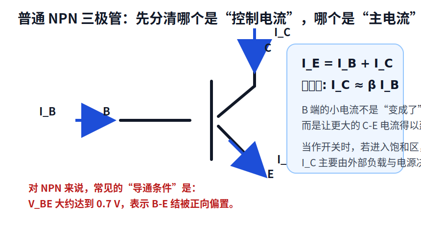
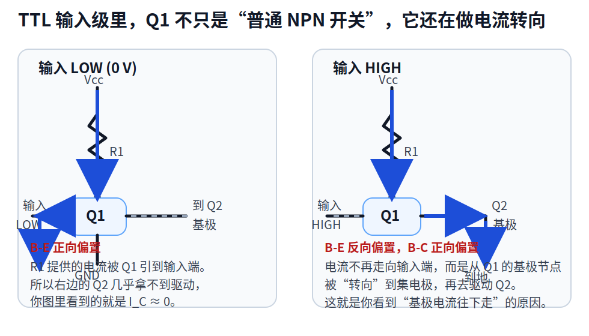
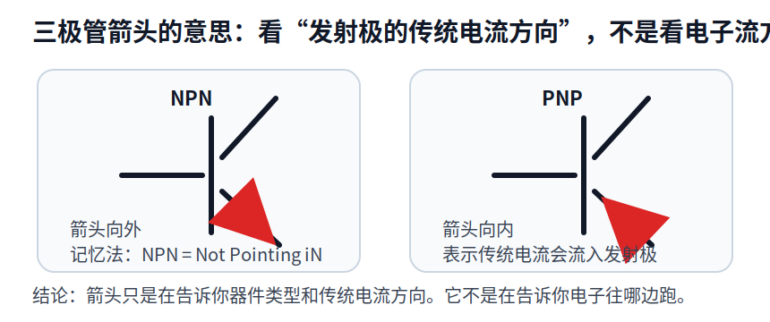
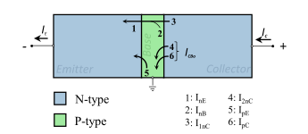
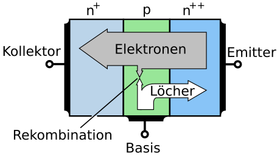
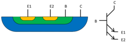

# 三极管与 TTL 输入级直观解释

这份笔记只解决你现在最卡的四件事：

1. 为什么会说 `B` 比 `E` 高大约 `0.7 V`，三极管就“导通”？
2. `I_B`、`I_C`、`I_E` 到底是什么关系？
3. 为什么在 TTL 电路里，电流看起来会从 `Q1` 的基极节点往下走？
4. 三极管符号上的箭头到底是什么意思？

## 1. 先把一句常见的话说准确

很多入门材料会说：

> 对 NPN 管，只要 `V_B` 比 `V_E` 高大约 `0.7 V`，三极管就导通。

这句话不算错，但它省略了很多关键条件，所以容易把人带偏。

更准确的说法是：

- `V_BE ≈ 0.7 V` 表示 **B-E 结被正向偏置**。
- 一旦 B-E 结正向偏置，三极管就具备了让 **C-E 主电流** 建立起来的条件。
- 但是，**主电流不是“从 B 端流出来的”**。
- `B` 端的电流只是一个较小的“控制电流”，真正较大的电流通常来自外部电源，经负载后流过 `C-E`。

下面这张图先把三个电流的角色分开：

最重要的两个式子只有这两个：

- `I_E = I_B + I_C`
- 在有源区里，常近似写成 `I_C ≈ β I_B`

你可以把它理解成：

- `I_B` 是“放行信号”
- `I_C` 是“主水流”
- `I_E` 是两者汇总后的流出电流

所以，**不要把 `I_B` 和 `I_C` 理解成同一股电流**。  
它们有关系，但不是“`I_B` 直接变成 `I_C`”。

## 2. 为什么明明说 B-E 正偏会导通，可 TTL 图里却看到电流从基极节点往下走？

这里最关键的一点是：

**你图里的 `Q1`，不是在“普通共射 NPN 开关”的工作方式下工作。**

TTL 输入级里的 `Q1` 是一个 **多发射极三极管**。它的作用不只是“开或关”，还会做一件很重要的事：

**把从 `R1` 来的电流，转向不同的路径。**

也就是说，在 TTL 这里你不能只盯着 `B-E` 一对端子看，而要同时看：

- `B-E` 结有没有正向偏置
- `B-C` 结有没有正向偏置
- 电流现在到底更容易从哪条路走掉

下面这张图，是把 TTL 输入级最关键的电流路径抽出来后的直观版：

### 情况 A：输入是 LOW

当输入端是 `0 V` 时：

- `Q1` 的某个 `B-E` 结正向偏置
- `R1` 送来的电流会先到 `Q1` 的基极节点
- 然后这股电流会经 `B-E` 结流到输入端，再流向地

也就是这条路：

`Vcc -> R1 -> Q1 基极节点 -> Q1 发射极 -> 输入 LOW -> GND`

这时候会发生什么？

- `Q1` 把基极节点钳在一个较低电位附近
- 右边后级晶体管 `Q2` 的基极得不到足够驱动
- 所以你图里才会出现 `I_C ≈ 0`

### 情况 B：输入是 HIGH

当输入端是 HIGH 时，事情变了：

- 输入端电位已经不低了
- `Q1` 的 `B-E` 结不再是正向偏置，甚至会变成反向偏置
- 于是，`R1` 送来的电流 **不容易再走向输入端**

那这股电流会去哪？

它会改走另一条路：

`Vcc -> R1 -> Q1 基极节点 -> Q1 集电极 -> Q2 基极 -> Q2 发射极 -> GND`

这就是你图里看到的“**基极电流往下走**”的本质。

更准确地说：

- 不是说“基极电流天然就该往下走”
- 而是说 **进入 `Q1` 基极节点的电流**，在这一种偏置条件下，被导向了 `Q1` 的集电极支路
- 所以你看起来像是在图里看到 “从 `B` 节点往下送电流”

## 3. 你真正混淆的点：B-E 导通，和整只三极管里所有电流方向，不是一回事

这是最容易混的地方，我单独说一下。

### 3.1 `V_BE ≈ 0.7 V` 说的是哪件事？

它只是在说：

- `B-E` 这个 PN 结正向偏置了

它**没有**直接告诉你：

- `B-C` 结现在是正偏还是反偏
- 器件是在有源区、截止区，还是饱和区
- 电流最终会不会被导向别的支路

### 3.2 普通开关电路时，为什么我们常说“B 控制 C-E”？

因为在普通 NPN 开关里，常见连接方式是：

- 发射极接地
- 集电极通过电阻接 `Vcc`
- 基极输入一个小电流

此时如果 `B-E` 正偏，就会建立较大的 `C-E` 电流，所以初学者很容易记成：

> B 一导通，C-E 就通了

这个记忆在普通开关场景里够用，但放到 TTL 输入级就不够了，因为 TTL 的 `Q1` 不只是一个普通开关，它的 `B-C` 结也参与了工作。

### 3.3 所以 `B` 端电流和 `C-E` 电流的关系到底是什么？

用最稳妥的话讲：

- 对普通 BJT 来说，`B` 端电流是控制量
- `C-E` 电流是主电流
- 在有源区可近似认为 `I_C ≈ β I_B`
- 但在饱和区，`I_C` 会更多由外部负载决定，而不是严格等于 `β I_B`

所以你以后如果看到一张图，不要先问：

> 这里是不是 B 端电流在流？

更应该先问：

> 现在哪一个结被正向偏置了？  
> 电流此刻最容易从哪条路走？

这才是看 TTL 这类电路时更有效的思路。

## 4. 三极管箭头是什么意思？

箭头这件事其实很简单，但教材常常一笔带过。

你只要记住一句：

**箭头画在发射极上，表示发射极的传统电流方向。**

对于两种最常见的 BJT：

- `NPN`：箭头向外
- `PNP`：箭头向内

经常有人把箭头理解成“电子往哪跑”，这是错的。  
**箭头表示的是传统电流方向，不是电子运动方向。**

一个常用记忆法：

- `NPN = Not Pointing iN`

也就是：

- `NPN` 的箭头 **不指向里面**

## 5. 什么叫“传统电流方向”？

这是你现在最需要补上的概念，因为箭头的定义就建立在它上面。

### 5.1 为什么要叫“传统”？

在电子被发现之前，人们已经先约定了一个电流方向：

- 规定 **正电荷移动的方向** 就叫电流方向

后来发现，在金属导线里真正大量移动的是电子，而电子带负电，所以：

- **电子运动方向** 和 **传统电流方向** 正好相反

也就是说：

- 如果电子往左跑
- 那么传统电流就记作往右流

这个历史约定一直沿用到今天，所以电路图里的电流箭头、三极管符号箭头、`I_B`、`I_C`、`I_E` 的正方向，默认都是 **传统电流方向**。

### 5.2 为什么教材不改成电子方向？

因为对于绝大多数电路分析，使用传统电流方向完全没问题，而且更方便统一：

- 电源正端流出、负端流回
- 二极管正向导通时，电流从阳极到阴极
- 三极管里，箭头也可以统一按“传统电流进入还是流出发射极”来画

所以你做题时最稳妥的原则是：

> 看到箭头，先按传统电流理解。  
> 不要先去想电子在往哪跑。

### 5.3 放到 NPN 和 PNP 上分别怎么理解？

- `NPN`：发射极箭头向外，表示 **传统电流从发射极流出**
- `PNP`：发射极箭头向内，表示 **传统电流流入发射极**

这只是一个 **符号约定 + 器件类型标记**。

它并不是在说：

- 这只管子现在一定导通
- 电子一定往箭头方向跑
- 集电极电流一定就沿着箭头方向

箭头只告诉你一件事：

- 这是哪一类三极管，以及发射极处传统电流的参考方向是什么

### 5.4 结合你课件第 10 页怎么读

你课件第 10 页右下角那个 NPN 符号里：

- 箭头在发射极
- 箭头向外

所以它告诉你：

- 这是 `NPN`
- 如果按传统电流来记，发射极电流 `I_E` 是“从管子流出发射极”那一侧

然后再结合左边那张开关图：

- 当 `V_BE > 0.7 V` 时，`B-E` 结正偏
- 集电极那边的主电流就能建立
- 传统电流方向通常画成 `Vcc -> 电阻 -> C -> E -> GND`

注意，这里仍然是在说 **传统电流**。  
如果你去想电子，那它们会沿着相反方向运动。

### 5.5 一句最省事的记法

以后看到三极管箭头，先在脑中自动补一句：

> 这是“传统电流”箭头，不是“电子流”箭头。

只要这一句不忘，你后面看 NPN/PNP 的符号就不会老打架。

## 6. 如何判断题目里是“普通 NPN 开关”还是“会转向电流的 TTL 输入器件”？

这部分是做题方法，不是器件物理本身。

### 6.1 先看结构，不要先套公式

如果你一看到三极管就直接套：

- `V_BE > 0.7 V` 导通
- `V_BE < 0.7 V` 截止

那你在普通开关题里通常没问题，但一到 TTL 输入级就会失误。

更好的顺序是：

1. 先看这个三极管周围接了什么
2. 再判断它只是一个普通开关，还是一个输入级“转向器件”
3. 最后才去看 `V_BE`、`V_BC` 和电流路径

### 6.2 普通 NPN 开关，长什么样？

普通开关题通常有这些特征：

- 只有一个发射极
- 发射极经常直接接地
- 集电极通过一个电阻接 `Vcc`
- 输出通常取在集电极
- 基极由一个输入信号通过电阻驱动

这类电路的思路通常就是：

- 看 `V_BE` 是否大于约 `0.7 V`
- 若正偏，则三极管导通
- 导通后集电极电压被拉低，或者负载被接通

你课件第 10 页左边那张图，就是这种最标准的入门型普通 NPN 开关。

### 6.3 TTL 输入级器件，长什么样？

TTL 输入级里那个 `Q1`，通常会带有下面这些信号：

- 左边接的是逻辑输入端，不只是一个简单偏置源
- 上面会有一个电阻从 `Vcc` 拉到 `Q1`
- `Q1` 右边不是直接接负载，而是接到后级三极管的基极
- `Q1` 往往是多发射极结构，或者画法上明显是在做输入门
- 整个电路旁边会写着 `TTL`、`NAND`、`inverter`、`input stage` 之类的字样

这时你就要警惕：

- 这个 `Q1` 很可能不是单纯“开关”
- 它可能在做 **输入判别 + 电流转向**

你课件第 13 页就是这种情况。

### 6.4 为什么 TTL 输入级不能只看 `V_BE`？

因为它有两个关键结都可能参与：

- `B-E` 结
- `B-C` 结

普通开关题里，很多时候 `B-C` 结不会成为分析主角。  
但在 TTL 输入级中，`Q1` 恰恰会利用：

- 输入 LOW 时，让电流走 `B-E`
- 输入 HIGH 时，让电流改走 `B-C`

所以它更像一个“根据输入电平切换电流路径”的器件。

### 6.5 做题时的快速判断流程

如果你考试里遇到一个你不确定的三极管，按下面流程判断：

1. 先看是不是单发射极，还是多发射极
2. 看发射极是不是直连地，还是接在输入线上
3. 看集电极后面接的是电阻/负载，还是另一级三极管的基极
4. 看这一级的任务是“拉低输出”，还是“决定后级有没有驱动”
5. 如果它明显在决定后级通不通，就别把它只当普通开关

如果符合下面这些条件，多半可以先按普通 NPN 开关处理：

- 发射极接地
- 集电极接负载
- 基极单独输入
- 输出直接取集电极

如果符合下面这些条件，就要考虑 TTL 输入级式的“电流转向”：

- 器件在逻辑门最前级
- 输入直接接到发射极一侧
- 右边连着后级三极管的基极
- 图上同时强调 HIGH/LOW 时不同电流路径

### 6.6 你这份课件里，第 10 页和第 13 页分别属于哪一种？

第 10 页：

- 是 **普通 NPN 开关的入门模型**
- 老师想先让你形成 `V_BE > 0.7 V` 时能导通的直觉

第 13 页：

- 是 **TTL 反相器的晶体管级实现**
- 这里的 `Q1` 是输入级器件，不再是单纯“开关”
- 它需要同时看 `B-E` 和 `B-C`，本质上是在给后级“分配电流路径”

所以这两页不是互相矛盾，而是：

- 第 10 页讲“最基础的开关模型”
- 第 13 页讲“这个模型在逻辑门里的进一步用法”

## 7. 把你给的 TTL 两张图，直接翻译成人话

你给的两张 TTL 图，其实可以直接读成下面这两句话：

### 输入 LOW 的那张图

- 输入脚把 `Q1` 的基极电流“拉走”了
- 所以这股电流没有去驱动后级
- 因此后级关断

### 输入 HIGH 的那张图

- 输入脚不再吸走这股电流
- 所以 `R1` 提供的电流从 `Q1` 的基极节点改走集电极支路
- 于是后级得到驱动

这就是 TTL 输入级的核心逻辑：

- **LOW**：把电流泄掉，不让它去驱动后级
- **HIGH**：不再泄掉，让它流向后级

## 8. 最后给你一个最省脑子的判断口诀

以后再看这类题，按这个顺序想：

1. 先看这是 `NPN` 还是 `PNP`
2. 再看 `B-E` 结是不是正向偏置
3. 再看 `B-C` 结有没有参与导通
4. 最后看电流从电源出发，最容易走到哪

如果是普通三极管开关：

- 常常只盯 `B-E` 就够用了

如果是 TTL 输入级这类特殊结构：

- 一定要把 `B-E` 和 `B-C` 两个结一起看

## 9. 结合你的课件，建议这样复习

只看你这份 slide 的话，我建议按这个顺序回看：

1. 先看第 10 页，只学一件事：普通 NPN 开关里，`V_BE` 正偏会让 `C-E` 主电流建立
2. 再看第 10 页右下角符号，只记一件事：箭头表示发射极的传统电流方向
3. 然后跳到第 13 页，注意 `Q1` 左边接输入、右边接后级，不是普通负载
4. 最后分别看 HIGH 和 LOW 两种情况，问自己：`R1` 送来的电流到底被导到哪里去了

如果你按这个顺序看，第 13 页就不会再像“突然换了一套规则”。

## 10. 网络原始参考图

下面这几张是我刚刚联网下载到本地的原始参考图，你可以把它们和上面我整理的示意图对照着看。

### 7.1 普通 NPN 的三个电流

这张图最适合配合本笔记第 1 节看，重点就是：

- `I_E = I_B + I_C`
- `I_C` 是主电流
- `I_B` 是较小的控制电流

### 7.2 普通 NPN 的基本导通机理

这张图更接近“为什么 `V_BE` 正偏后，会建立 `C-E` 主电流”的物理直觉。

### 7.3 多发射极三极管

这张图对应的就是 TTL 输入级里的 `Q1` 这种器件类型。  
你在 TTL 图里看到的特殊现象，本质上就是这个结构让 `Q1` 可以把电流导向不同支路。

### 7.4 TTL NAND 内部晶体管结构

这张图适合在你已经理解上面文字之后再看，因为它信息量比较大。  
你可以只盯着输入级 `Q1` 和它后面的第一个晶体管，先别一次把整个门全看完。

## 11. 参考资料

下面这些链接是我整理这份说明时用到的原理参考：

- [Bipolar junction transistor - Wikipedia](https://en.wikipedia.org/wiki/Bipolar_junction_transistor)
- [Multiple-emitter transistor - Wikipedia](https://en.wikipedia.org/wiki/Multiple-emitter_transistor)
- [Transistor-transistor logic - Wikipedia](https://en.wikipedia.org/wiki/Transistor%E2%80%93transistor_logic)

这份 Markdown 里的前三张图是我根据这些原理重新整理绘制的，目的是把你当前的疑问讲得更直观一些；第 7 节的图则是联网下载到本地的原始参考图。
