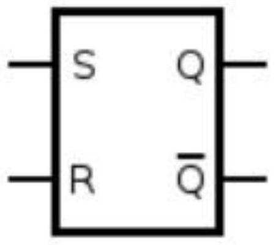
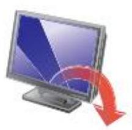

# lecture_9 part 1

## 感谢各位同学参与课程评教

## （浏览器链接） https：／／evaluation．shanghaitech．edu．cn

期末课程评教入口二维码

## ee115b Digital Circuits

Instructor：Chenxi Xiao
Part of slides are from
（c）Pearson Education
Hengzhao Yang
Zhifeng Zhu
Yajun Ha

# Sequential Logic

Basic SR Latch

Gated SR Latch

## Limitations of Combinational Logic

Can we build a circuit using combinational logic？
When a button is pushed：
Turn on the light when if it off
Turn off the light when it is on．

## Sequential logic circuits

Have memory and their outputs depend on both current and past inputs，allowing for the storage and manipulation of information over time．

## Basic SR Latch

SR Latch：a digital logic circuit that has two stable states and can store one bit of data

（a）Active－HIGH input S－R latch

（b）Active－LOW input

$\overline{\mathrm{S}}-\overline{\mathrm{R}}$

latch

（a）Active－HIGH input S－R latch

（b）Active－LOW input

$\overline{\mathrm{S}}-\overline{\mathrm{R}}$

latch

## Basic SR Latch: Its Function

## Function of SR Latch

(a) Active-HIGH input S-R latch

(b) Active-LOW input

$\overline{\mathrm{S}}-\overline{\mathrm{R}}$

latch

Characteristic Table: Describes next state given input and current state. (Similar to truth table, but focus on states)

## TABLE 7-1

Truth table for an active-LOW input $\overline{\mathrm{S}}-\overline{\mathrm{R}}$ latch.

| Inputs |  | Outputs |  | Comments |
| --- | --- | --- | --- | --- |
| $\overline{\boldsymbol{S}}$ | $\overline{\boldsymbol{R}}$ | $Q$ | $\bar{Q}$ |  |
| 1 | 1 | NC | NC | No change. Latch remains in present state. |
| 0 | 1 | 1 | 0 | Latch SET. |
| 1 | 0 | 0 | 1 | Latch RESET. |
| 0 | 0 | 1 | 1 | Invalid condition |

## Basic SR Latch：Active Low vs Active High

TABLE 7－1

Active low

Truth table for an active－LOW input $\overline{\mathrm{S}}-\overline{\mathrm{R}}$ latch．
| Inputs | | Outputs | | Comments |
| :— | :— | :— | :— | :— |
| $\overline{\boldsymbol{S}}$ | $\overline{\boldsymbol{R}}$ | $Q$ | $\bar{Q}$ | |
| 1 | 1 | NC | NC | No change．Latch remains in present state． |
| 0 | 1 | 1 | 0 | Latch SET． |
| 1 | 0 | 0 | 1 | Latch RESET． |
| 0 | 0 | 1 | 1 | Invalid condition |

Active high

| S | R | $\mathrm{Q}_{a}$ | $\mathrm{Q}_{b}$ |
| --- | --- | --- | --- |
| 0 | 0 | $0 / 1$ | $1 / 0$ |
| 0 | 1 | 0 | 1 |
| 1 | 0 | 1 | 0 |
| 1 | 1 | 0 | 0 |

## Basic SR Latch: How circuit works?

## TABLE 7-1

Truth table for an active-LOW input $\overline{\mathrm{S}}-\overline{\mathrm{R}}$ latch.
| Inputs | | Outputs | | Comments |
| :— | :— | :— | :— | :— |
| $\overline{\boldsymbol{S}}$ | $\overline{\boldsymbol{R}}$ | $Q$ | $\bar{Q}$ | |
| 1 | 1 | NC | NC | No change. Latch remains in present state. |
| 0 | 1 | 1 | 0 | Latch SET. |
| 1 | 0 | 0 | 1 | Latch RESET. |
| 0 | 0 | 1 | 1 | Invalid condition |

Latch starts out RESET ( $Q=0$ ).

Latch starts out SET (

$Q=1$

).

1. Two possibilities for the SET operation

## Basic SR Latch: How circuit works?

## TABLE 7-1

Truth table for an active-LOW input $\overline{\mathrm{S}}-\overline{\mathrm{R}}$ latch.
| Inputs | | Outputs | | Comments |
| :— | :— | :— | :— | :— |
| $\overline{\boldsymbol{S}}$ | $\overline{\boldsymbol{R}}$ | $Q$ | $\bar{Q}$ | |
| 1 | 1 | NC | NC | No change. Latch remains in present state. |
| 0 | 1 | 1 | 0 | Latch SET. |
| 1 | 0 | 0 | 1 | Latch RESET. |
| 0 | 0 | 1 | 1 | Invalid condition |

Latch starts out

$\operatorname{SET}(Q=1)$

.

Latch starts out RESET (

$Q=0$

).

1. Two possibilities for the RESET operation

## Basic SR Latch：How circuit works？

## TABLE 7－1

Truth table for an active－LOW input $\overline{\mathrm{S}}-\overline{\mathrm{R}}$ latch．
| Inputs | | Outputs | | Comments |
| :— | :— | :— | :— | :— |
| $\overline{\boldsymbol{S}}$ | $\overline{\boldsymbol{R}}$ | $Q$ | $\bar{Q}$ | |
| 1 | 1 | NC | NC | No change．Latch remains in present state． |
| 0 | 1 | 1 | 0 | Latch SET． |
| 1 | 0 | 0 | 1 | Latch RESET． |
| 0 | 0 | 1 | 1 | Invalid condition |

Outputs do not change state．Latch remains SET if previously SET and remains RESET if previously RESET．

HIGHS on both inputs
（c）No－change condition

（d）Invalid condition

## Race Hazard Conditions

－A hazard is an unwanted temporary change（glitch or spike）in the output of a digital circuit
－A race hazard occurs when two or more signals change simultaneously and compete to control the output．Because of unequal propagation delays，the final output depends on which signal arrives first， potentially causing unpredictable behavior．

## Race Hazard：Examples

（d）Invalid condition

## https：／／en．wikipedia．org／wiki／Race＿condition

## Basic SR Latch: Timing Diagram

## Timing diagram (assume no propagation delay)

| S | R | $\mathrm{Q}_{a}$ | $\mathrm{Q}_{b}$ |
| --- | --- | --- | --- |
| 0 | 0 | $0 / 1$ | $1 / 0$ |
| 0 | 1 | 0 | 1 |
| 1 | 0 | 1 | 0 |
| 1 | 1 | 0 | 0 |

## Basic SR Latch：VHDL

VHDL implementation

entity SRLatch is
port（SNot，RNot：in std＿logic；Q，QNot：inout std＿logic）； end entity SRLatch；
architecture LogicOperation of SRLatch is begin

Q＜＝QNot nand SNot；}Boolean expressions QNot＜＝Q nand RNot； $\int$ define the outputs end architecture LogicOperation；

SNot：SET complement RNot：RESET complement Q：Latch output QNot：Latch output complement

（b）Active－LOW input

$\overline{\mathrm{S}}-\overline{\mathrm{R}}$

latch

## Basic SR Latch：Applications

## Application：eliminate the effects of switch bounce

If bounce happens： 11 ＝no change

## 74HC279A

（a）Logic diagram

## Function Table

| Inputs |  | Output |
| --- | --- | --- |
| $\overline{\mathrm{S}}^{\boldsymbol{*} \mathbf{2}}$ | $\overline{\mathrm{R}}$ | Q |
| H | H | $\mathrm{Q}_{0}$ |
| L | H | H |
| H | L | L |
| L | L | $\mathrm{H}^{* 1}$ |

H ：High level
L ：Low level
$Q_{0}$ ：The level of Q respectively，before the indicated steady－state input conditions were established．
Notes：1．It is unpredictable，if $\overline{\mathrm{S}}$ or $\overline{\mathrm{R}}$ goes High．
2．As to latches which has two $\overline{\mathrm{S}}$ inputs．
H：Both of $\overline{\mathrm{S}}$ inputs are high．
L：Either or both of $\overline{\mathrm{S}}$ inputs are low．

## Gated SR Latch

Gated SR latch：Add a Clock（or named Enable）input （avoid glitches，allowing better synchronization）
Example：bus sender and receiver synchronization．

（a）Logic diagram

（b）Logic symbol

Control signal name：EN or CLK
Clk＝0，disabled：latched
Clk＝1，enabled：basic SR latch

| Clk | $S$ | $R$ | $Q(t+1)$ |
| --- | --- | --- | --- |
| 0 | $x$ | $x$ | $Q(t)$（no change） |
| 1 | 0 | 0 | $Q(t)$（no change） |
| 1 | 0 | 1 | 0 |
| 1 | 1 | 0 | 1 |
| 1 | 1 | 1 | $x$ |

## Gated SR Latch

## Two implementations

－NOR gates
－NAND gates

NAND gate implementation

| Clk | $S$ | $R$ | $Q^{+}$ | Comments |
| --- | --- | --- | --- | --- |
| 0 | $\times$ | $\times$ | $Q$ | No change，typically stable states $Q=0, \bar{Q}=1$ or $Q=1, \bar{Q}=0$ |
| 1 | 0 | 0 | $Q$ | No change，typically stable states $Q=0, \bar{Q}=1$ or $Q=1, \bar{Q}=0$ |
| 1 | 0 | 1 | 0 | Reset |
| 1 | 1 | 0 | 1 | Set |
| 1 | 1 | 1 | $\times$ | Avoid this setting |

## Gated SR Latch：Timing diagram

－Timing diagram
－Q only changes when CLK＝1

## Gated D Latch

－Foundation for D Flip Flop
－Memory－like input（intuitive）．
－Mitigate Race Hazard problem．

| Clk | D | $\mathrm{Q}(t+1)$ |
| --- | --- | --- |
| 0 | x | $\mathrm{Q}(t)$ |
| 1 | 0 | 0 |
| 1 | 1 | 1 |

Only one input：D（data）
－Clk＝1：output（Q）follows input（D）
－ $\mathrm{Clk}=0$ ： Q holds its previous value

## Gated D Latch

## Timing diagram

## VHDL code for gated D Latch

LIBRARY ieee ；
USE ieee．std＿logic＿1164．all ；
ENTITY latch IS
PORT（ $\mathrm{D}, \mathrm{Clk}$ ：IN STD＿LOGIC ；
Q ：OUT STD＿LOGIC）；
END latch ；

| Clk | D | $\mathrm{Q}(t+1)$ |
| --- | --- | --- |
| 0 | x | $\mathrm{Q}(t)$ |
| 1 | 0 | 0 |
| 1 | 1 | 1 |

ARCHITECTURE Behavior OF latch IS BEGIN

PROCESS（ D，Clk ）
BEGIN
IF $\mathrm{Cl} \mathrm{k}={ }^{\prime} 1^{\prime}$ THEN
$\mathrm{Q}<=\mathrm{D} ;$
END IF ；
END PROCESS ；
END Behavior ；