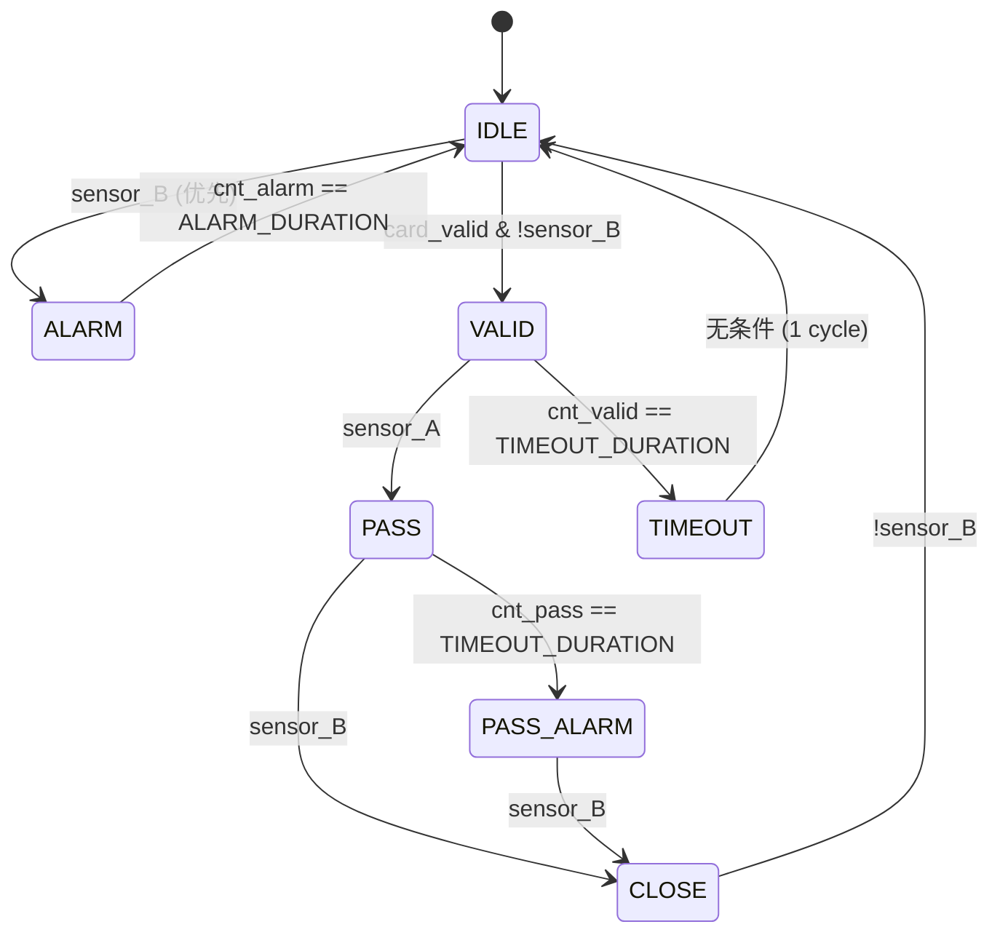

# EE115B Project — Subway Turnstile Controller

<aside>
🚇

**主题：** Subway Turnstile Controller —— 用 Moore FSM 增量搭建地铁闸机控制器

**课程：** EE115B 数字电路 · 课程支持（Projects）

**总分：** 100 pts（4 个 Verilog 模块 ×20 + report ×20）

**工具链：** iverilog + GTKWave

**核心脉络：** 2-state → 4-state with dual sensors → 加 ALARM 反向闯入 → 加 TIMEOUT / PASS_ALARM 超时保护

**⚠️ 重要规则：禁止用 AI 写 RTL（小五只能帮审思路、debug 波形、查 spec、画状态图）**

</aside>

## 🧭 题干总览

一句话：**同一个地铁闸机，从最简单的“刷卡开门 → 走过关门”二态模型出发，逐步加上双传感器、反向闯入报警、超时保护，最终演化成 7 状态的完整控制器。** 四个 part 难度递增、状态层层叠加，每个 part 本质都在回答“出现某种异常该怎么办”。

- **统一约束：全程 Moore 型** —— 所有输出（`gate_open / led_red / led_green / alarm / timeout`）只由当前 state 决定，不能混进时序块。
- **复位：异步低有效** `rst_n` —— 模板固定 `always @(posedge clk or negedge rst_n)`。
- **传感器语义**：`sensor_A` = 进闸侧被挡，`sensor_B` = 出闸侧被挡，`card_valid` = 单 cycle 有效刷卡脉冲。
- **演化主线**：Part 1 正常通行（2 态）→ Part 2 双 sensor 全流程（4 态）→ Part 3 反向闯入 + ALARM → Part 4 两类超时 + TIMEOUT / PASS_ALARM。

<aside>
🎯

**三条贯穿全程的铁律：** ① 全 Moore，输出只看 state；② IDLE 里 `sensor_B` 优先级 > `card_valid`（Part 3 起绝不能错）；③ 两类“超时”方向相反 —— TIMEOUT 关门（人没进），PASS_ALARM 开门报警（人卡里面）。

</aside>

## 📋 交付清单速览

| Part | 任务 | 交付文件 | 分值 |
| --- | --- | --- | --- |
| Part 1 | 两状态闸机 | `part1.v` | 20 |
| Part 2 | 四状态访问控制（双 sensor） | `part2.v`  • `part2_tb.v` | 20 |
| Part 3 | 反向闯入检测 + ALARM | `part3.v` | 20 |
| Part 4 | 超时自动关门 + PASS_ALARM | `part4.v`  • `part4a_tb.v`  • `part4b_tb.v` | 20 |
| Report | 状态机图 + 仿真波形 | `report.pdf` | 20 |

## 0⃣ Part 0 — Preparation

- 安装 **iverilog**（编译 + 仿真）+ **GTKWave**（看波形），按 tutorial 走。
- 装好后先跑一个 hello-world Verilog，确认能产出 `.vcd` 且 GTKWave 能打开。

## 1⃣ Part 1 — Two-State Turnstile (20 pts)

<aside>
📖

**题目概述：** 最简单的闸机：默认关闭；乘客刷卡后开门放行；人走过后闸机自动关闭并等下一人。系统始终在两个状态间切换——关门（红灯亮、禁止通行）与开门（绿灯亮、允许通行）。有效刷卡（`card_valid=1`）使 LOCKED→UNLOCKED；红外检测到有人通过（`sensor_B=1`）使 UNLOCKED→LOCKED。复位后初始状态为 LOCKED。

</aside>

### 状态机

- **LOCKED**（复位初值）：`gate_open=0, led_red=1, led_green=0`
- **UNLOCKED**：`gate_open=1, led_red=0, led_green=1`

### 转移条件

- `LOCKED → UNLOCKED`：$\text{card\_valid} = 1$
- `UNLOCKED → LOCKED`：$\text{sensor\_B} = 1$

### 信号表

| Signal | Dir | Width | Description |
| --- | --- | --- | --- |
| clk | in | 1 | 系统时钟 |
| rst_n | in | 1 | 异步低有效复位 |
| card_valid | in | 1 | 有效刷卡脉冲（1 cycle） |
| sensor_B | in | 1 | 红外通过检测（1 = 人挡住） |
| gate_open | out | 1 | 闸门控制（1 = 开） |
| led_green | out | 1 | 绿灯（允许通过） |
| led_red | out | 1 | 红灯（禁止通过） |


Slide 2 — Part 1 信号表 & 参考波形（含 card_valid=0 时锁定的反例）

### 设计要点

- `rst_n` **异步低有效** → `always @(posedge clk or negedge rst_n)` 模板
- `card_valid` 是**单 cycle 脉冲**，看电平即可，**不用**等 rising edge
- Moore 三盏灯 / `gate_open` 是**纯组合**，由 current state 决出，别写进时序块

<aside>
🎯

**口诀：** Moore 三盏灯纯组合，FSM 只看 state；card_valid 是脉冲不用等边沿。

</aside>

## 2⃣ Part 2 — Basic Access Control (20 pts)

<aside>
📖

**题目概述：** 在两状态基础上加入双红外传感器（`sensor_A` 进闸侧、`sensor_B` 出闸侧），用四个状态完整刻画“刷卡 → 进闸 → 穿过通道 → 出闸关门”的全流程。需严格遵守状态转移与忽略规则（非 IDLE 忽略刷卡等），并自写 testbench 复现参考通行波形。

</aside>

双 sensor (`sensor_A` 进闸侧、`sensor_B` 出闸侧) 让 FSM 真正贴合"刷卡→进闸→出闸→关门"全流程。


Slide 3 — Part 2 双 sensor 闸机结构 & 四状态说明

### 四个状态（Moore 型）

| State | gate_open | led_green | led_red | 含义 |
| --- | --- | --- | --- | --- |
| IDLE | 0 | 0 | 1 | 等卡 |
| VALID | 1 | 1 | 0 | 卡通过，开门等进闸 |
| PASS | 1 | 1 | 0 | 人已进通道，等出闸 |
| CLOSE | 0 | 0 | 1 | 人走完，准备回 IDLE |

复位初值：**IDLE**。

### 转移条件

- `IDLE → VALID`：`card_valid == 1`
- `VALID → PASS`：`sensor_A == 1`（进闸侧被挡）
- `PASS → CLOSE`：`sensor_B == 1`（出闸侧被挡）
- `CLOSE → IDLE`：`sensor_B == 0`（人完全出去，下一拍走）


Slide 4 — Part 2 信号表 & 完整通行参考波形

<aside>
⚠️

**spec 严格规则：**

- 非 IDLE 状态全部忽略 `card_valid`
- IDLE 状态下没刷卡就触发 `sensor_A` → 忽略，保持 IDLE
- CLOSE 状态等 `sensor_B` 回 0 才走（隐含的去抖语义）
</aside>

<aside>
🎯

**口诀：** VALID 与 PASS 输出相同但状态必须分开 —— 它们的"下一步"不一样（一个等 A、一个等 B），这就是 Moore FSM"状态不能合"的典型例子。

</aside>

### testbench 自己写 (`part2_tb.v`)

必须复现 spec 参考波形序列：

```
rst_n=0 → rst_n=1 → 脉冲 card_valid → sensor_A=1 → sensor_A=0
→ sensor_B=1 → sensor_B=0 → 观察 state 回 IDLE
```

## 3⃣ Part 3 — Reverse Intrusion Detection (20 pts)

<aside>
📖

**题目概述：** 增加反向闯入检测：若在 IDLE（未刷卡）状态下先触发出闸侧 `sensor_B`，判定为有人从月台侧反向硬闯，进入 ALARM 报警状态，持续 `ALARM_DURATION` 个周期后自动回 IDLE。spec 规定：IDLE 中 `sensor_B` 的优先级高于 `card_valid`。

</aside>

### 物理直觉

- 正常通行：`sensor_A` 先响 → `sensor_B` 再响
- 反向闯入：IDLE 状态（没刷卡）下 `sensor_B` 突然响 → 有人从月台侧硬闯

### 新增状态：ALARM

- 输出：`alarm=1, gate_open=0, led_red=1`
- 持续：**`ALARM_DURATION = 10`** 个 cycle（spec 强制，不能改）
- 到时自动回 IDLE

### IDLE 状态判优顺序 ⚠️

spec 原文：*"in the IDLE state, sensor_B has higher priority than card_valid"*

```verilog
// IDLE 分支的伪代码
if      (sensor_B)    next = ALARM;
else if (card_valid)  next = VALID;
else                  next = IDLE;
```

即使 `sensor_B` 与 `card_valid` 同时为 1，**也必须走 ALARM**。


Slide 5 — Part 3 反向闯入触发 ALARM 的参考波形

<aside>
⚠️

**易扣分点：**

- if-else 顺序写反 → 反向闯入检测失效
- 用 hardcode `10` 而不是 `ALARM_DURATION` → 扣分
- alarm 高电平宽度 ≠ 10 个 clk period → counter 边界算错（off-by-one）
</aside>

### counter 实现思路

用 `reg [3:0] alarm_cnt;` 进入 ALARM 时清零，每拍 +1，到 `ALARM_DURATION - 1` 时下一拍跳回 IDLE。Moore FSM 下：**alarm 高电平宽度 = ALARM 状态停留宽度**。

<aside>
🎯

**口诀：** IDLE 里 sensor_B 永远比 card_valid 优先；alarm 拉高时长 = ALARM 状态停留时长。

</aside>

### testbench

Part 3 testbench 已提供，**不用自己写**。

## 4⃣ Part 4 — Timeout Auto-Close (20 pts)

<aside>
📖

**题目概述：** 加入两类超时保护：刷卡后在 VALID 内超时仍未进闸 → 进入 TIMEOUT（自动关门，1 拍后回 IDLE）；进闸后在 PASS 内超时仍未出闸 → 进入 PASS_ALARM（保持开门并报警，避免夹人，等人离开后经 CLOSE 回 IDLE）。所有延时用参数（`TIMEOUT_DURATION` / `ALARM_DURATION`），不得硬编码；提供两个 testbench 分别验证超时与正常通行。

</aside>

最复杂的一 part，引入**两个独立超时**和**两个新状态**。

### 新增状态 1：TIMEOUT

- 触发：在 VALID 状态内 cnt 到 `TIMEOUT_DURATION` 还没看到 `sensor_A` → 刷了卡没进闸
- 输出：`gate_open=0, led_red=1, led_green=0, timeout=1`
- 持续：**1 拍**，无条件回 IDLE

### 新增状态 2：PASS_ALARM

- 触发：在 PASS 状态内 cnt 到 `TIMEOUT_DURATION` 还没看到 `sensor_B` → 人卡通道里
- 输出：`alarm=1, gate_open=1, led_red=1, led_green=0, timeout=0`
- 离开：`sensor_B = 1` → CLOSE → `sensor_B = 0` → IDLE

<aside>
🔑

**为什么 PASS_ALARM 的 gate_open 还是 1？**

人已经在通道里，强行关门会**夹人** —— 只能报警求救，等他自己挪走 (`sensor_B = 1`) 后走 CLOSE 的正常回归。

</aside>

### 完整状态机（Part 4 终极版）




Slide 6 — Part 4 超时未通行的 timeout 自动关门参考波形


Slide 7 — Part 4 正常通行波形（验证 timeout 始终为 0）

<aside>
⚠️

**spec 强制要求：**

- 三个 counter 思路必须清晰：`cnt_alarm`（ALARM 用 ALARM_DURATION）、`cnt_valid`（VALID 等进闸 TIMEOUT_DURATION）、`cnt_pass`（PASS 等出闸 TIMEOUT_DURATION）
- **不能 hardcode 任何 delay 数字**，全部用 `ALARM_DURATION` / `TIMEOUT_DURATION` 参数
- TIMEOUT 停留 1 拍就走，PASS_ALARM **不直接回 IDLE**，必须经 CLOSE
</aside>

### 两个 testbench

- `part4a_tb.v`：刷卡后**不**触发 `sensor_A` → 复现 timeout 自动关门波形
- `part4b_tb.v`：在 timeout 前完成 `sensor_A → sensor_B` → 验证 `timeout` 始终为 0

<aside>
🎯

**口诀：** TIMEOUT 是"人没进来"（关门）；PASS_ALARM 是"人卡里面"（开门 + 报警） —— 方向截然相反不要混。

</aside>

## 📝 Report 要求 (20 pts)

`report.pdf` 必须包含：

1. **每一 part 的状态机图**：state 名称 + 转移箭头条件 + **每个状态内部 / 旁边写明所有输出信号值**（Moore 标志）
2. **每一 part 的仿真波形**：iverilog → `.vcd` → GTKWave 截图，关键信号齐全（`clk, rst_n, card_valid, sensor_A, sensor_B, state, gate_open, led_*, alarm, timeout`）
3. **设计说明**：FSM 设计如何满足 spec，波形如何验证实现

## 📦 提交结构

```
姓名_学号.zip   （例：张三_2022123456.zip）
├── part1/
│   └── part1.v
├── part2/
│   ├── part2.v
│   └── part2_tb.v
├── part3/
│   └── part3.v
├── part4/
│   ├── part4.v
│   ├── part4a_tb.v
│   └── part4b_tb.v
└── report.pdf
```

<aside>
📦

自动评测脚本会扫描目录层级 / 文件名，**严格按这个**，多一层少一层都可能识别失败。

</aside>

## 🚨 易忽视的 spec 细节（打分点集中地）

- [ ]  全 Moore 型，输出由 state 决定，**不混进时序块**
- [ ]  异步低有效复位：`always @(posedge clk or negedge rst_n)`
- [ ]  IDLE 里 `sensor_B` 优先于 `card_valid`（Part 3 起绝对不能错）
- [ ]  `ALARM_DURATION` / `TIMEOUT_DURATION` 参数化，**禁止硬编码**
- [ ]  `CLOSE → IDLE` 必须等 `sensor_B = 0`
- [ ]  `PASS_ALARM` 不直接回 IDLE，必须**经 CLOSE**
- [ ]  非 IDLE 状态忽略 `card_valid`；IDLE 里没刷卡时忽略 `sensor_A`
- [ ]  testbench 自己加 corner case（连续刷卡 / cnt 边界 ±1 / ALARM 期间又来 card_valid …）
- [ ]  **绝对不能用 AI 写 RTL** —— 设计思路 / debug / 状态图可以问我

## 🧠 推荐攻关顺序

1. 装 iverilog + GTKWave，跑通 hello-world，确认 vcd → GTKWave pipeline 通
2. Part 1 → 2 → 3 → 4 顺着写，每写完一 part 立刻用 tb 跑波形
3. **写完一 part 立刻截 GTKWave 图存 report**，不要全写完再回头截
4. 状态机图建议用 [draw.io](http://draw.io) / Excalidraw / TikZ 手绘（Moore 输出标注塞节点里 Mermaid 会比较挤）
5. 最后通审 spec 的每一条 "Note that…" / "Please do not modify" 防扣分

## 📚 本节核心

<aside>
🎯

**三大记忆口诀：**

1. **Moore FSM** —— 输出只由 state 决定，组合逻辑别混进 `always @(posedge clk)` 时序块
2. **优先级铁律** —— IDLE 里 `sensor_B` > `card_valid`（Part 3 起绝对不能错）
3. **两类"超时"方向相反** —— TIMEOUT 关门（人没进），PASS_ALARM 开门报警（人卡里面）
</aside>

## 📎 原始 Slides

[problem.pdf](EE115B%20Project%20%E2%80%94%20Subway%20Turnstile%20Controller/problem.pdf)
