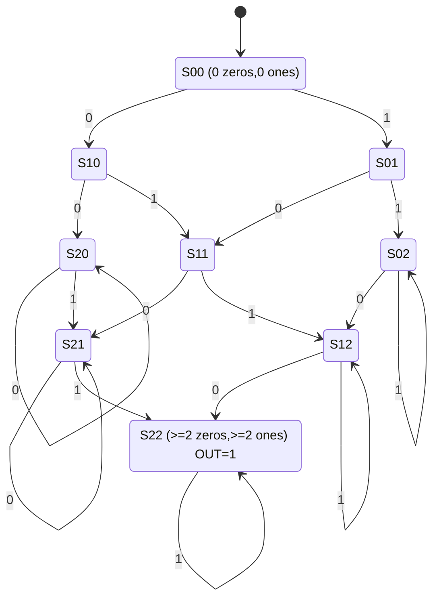
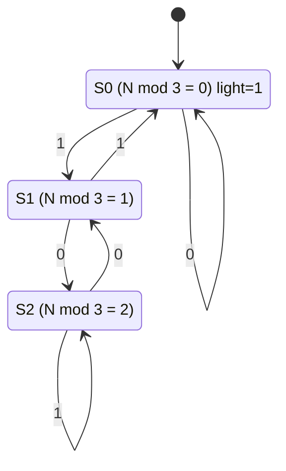
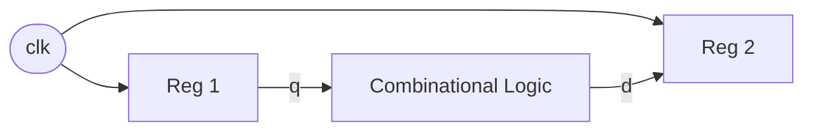
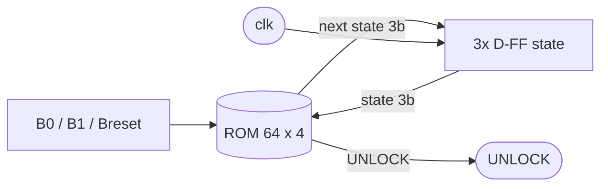
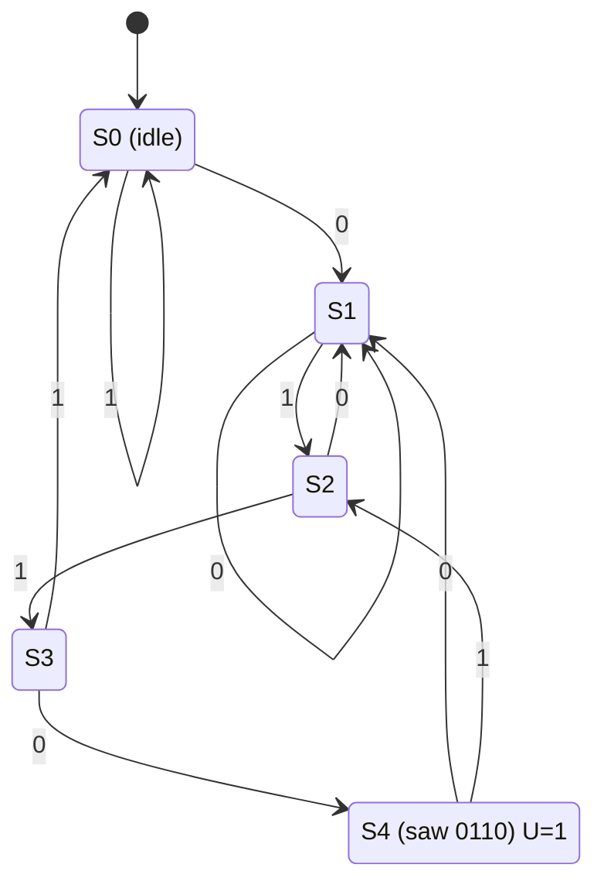

# EE115B 期末模拟练习（英文 · 边做边复习）

<aside>
✍️

**用途：** 按**期末考点**（30% 基础 + 70% combinational / sequential / ADC-DAC）＋ **期中试卷风格**（重 concept：choice / true-false / fill-in-blank + comprehensive）出的英文练习题。

**用法：** 每一 Part 前有「📌 知识点回顾」，先扫一眼再做题；做完整个小节再展开「✅ 答案与解析」自查，不要边做边偷看（这正是 ADHD 最容易丢分的地方——手没真正走完逻辑）。

**今晚学习块：** 本页只锁定 **1 个 25–45 分钟 block**，建议先做 Part I + Part II（concept 部分），把手感和概念稳住，再挑战 Part IV 的综合题。中途冒出来的别的念头先记进 cache，别切题。

</aside>

## Ⅰ. Multiple Choice（概念题 · 期中主力题型）

<aside>
📌

**知识点回顾：** universal gates(通用门) / decoder · MUX 的输入输出关系 / Moore vs Mealy / flip-flop 触发方式 / mod-N counter 所需 FF 数 / ADC·DAC 类型与 quantization(量化) / hazard / two's complement(补码) / Verilog 概念。

</aside>

Select the **ONE** best answer for each question.

1. A multiplexer (MUX) with `n` select lines can route how many data inputs?
    - [ ]  A. `n`
    - [ ]  B. `2n`
    - [x]  C. `2^n`
    - [ ]  D. `n^2`
2. Which of the following gates is **NOT** a universal gate?
    - [ ]  A. NAND
    - [ ]  B. NOR
    - [x]  C. AND
    - [ ]  D. (both NAND and NOR are universal)
3. A 3-to-8 line decoder activates how many of its outputs for any single valid input combination?
    - [ ]  A. None
    - [x]  B. Exactly one
    - [ ]  C. Exactly three
    - [ ]  D. All eight
4. Which statement correctly distinguishes a flip-flop from a latch?
    - [ ]  A. A latch is edge-triggered; a flip-flop is level-sensitive
    - [x]  B. A flip-flop is edge-triggered; a latch is level-sensitive
    - [ ]  C. Both are edge-triggered
    - [ ]  D. Both are level-sensitive
5. In a **Moore** finite state machine, the output depends on:
    - [x]  A. The present state only
    - [ ]  B. The inputs only
    - [ ]  C. Both present state and current inputs
    - [ ]  D. The next state only
6. The minimum number of flip-flops required to build a **mod-12** counter is:
    - [ ]  A. 3
    - [x]  B. 4
    - [ ]  C. 6
    - [ ]  D. 12
7. The main advantage of an **R-2R ladder** DAC over a binary-weighted-resistor DAC is:
    - [ ]  A. It is faster in every case
    - [ ]  B. It uses only two distinct resistor values, easing fabrication and matching
    - [ ]  C. It needs no operational amplifier
    - [x]  D. It has infinite resolution
8. Which ADC architecture is the **fastest** (but most hardware-expensive)?
    - [ ]  A. Successive-approximation (SAR)
    - [ ]  B. Counter / digital-ramp
    - [x]  C. Flash (parallel)
    - [ ]  D. Dual-slope integrating
9. An ADC that uses a register to test one bit at a time, from MSB to LSB, is a:
    - [ ]  A. Flash ADC
    - [x]  B. Successive-approximation (SAR) ADC
    - [ ]  C. Digital-ramp ADC
    - [ ]  D. Sigma-delta ADC
10. An ideal `n`-bit ADC divides the input range into how many quantization levels?
    - [ ]  A. `n`
    - [ ]  B. `2n`
    - [x]  C. `2^n`
    - [ ]  D. `2^n - 1`
11. A **static-1 hazard** occurs when a combinational output that should stay at logic `1`:
    - [ ]  A. Goes to high-impedance
    - [x]  B. Momentarily glitches to `0` and back to `1`
    - [ ]  C. Oscillates forever
    - [ ]  D. Stays at `1` with no glitch
12. An **essential prime implicant** is a prime implicant that:
    - [ ]  A. Is the largest group on the K-map
    - [x]  B. Covers at least one minterm covered by no other prime implicant
    - [ ]  C. Contains only don't-care terms
    - [ ]  D. Can always be removed from the final expression
13. The **setup time** of a flip-flop is the interval during which the data input must be stable:
    - [x]  A. After the active clock edge
    - [ ]  B. Before the active clock edge
    - [ ]  C. During the entire clock high phase
    - [ ]  D. Only at power-up
14. A JK flip-flop with `J = K = 1` will, on each active clock edge:
    - [ ]  A. Set (`Q = 1`)
    - [ ]  B. Reset (`Q = 0`)
    - [ ]  C. Hold its state
    - [x]  D. Toggle
15. A gated D latch with its enable input at `0` (inactive) will:
    - [ ]  A. Follow the D input transparently
    - [x]  B. Hold its previous (latched) value
    - [ ]  C. Reset to `0`
    - [ ]  D. Enter high-impedance
16. A ROM with 10 address lines and 8-bit data words has a total capacity of:
    - [ ]  A. `80` bits
    - [ ]  B. `1024` bits
    - [x]  C. `1024 × 8 = 8192` bits
    - [ ]  D. `2^18` bits
17. The defining property of **Gray code** is that:
    - [ ]  A. It is a weighted code
    - [x]  B. Successive codes differ in exactly one bit
    - [ ]  C. It is self-complementing
    - [ ]  D. Each digit maps to 4 bits
18. The Verilog statement `always @(posedge clk)` is used to describe:
    - [ ]  A. Purely combinational logic
    - [x]  B. Sequential (clocked) logic
    - [ ]  C. A testbench stimulus only
    - [ ]  D. A continuous assignment
19. For correctly modeling sequential logic in Verilog, you should use:
    - [ ]  A. Blocking assignments (`=`)
    - [x]  B. Non-blocking assignments (`<=`)
    - [ ]  C. Continuous assignments (`assign`)
    - [ ]  D. `initial` blocks
20. Adding two two's-complement numbers, overflow has occurred when:
    - [ ]  A. There is any carry out of the MSB
    - [x]  B. The carry into the MSB differs from the carry out of the MSB
    - [ ]  C. The result is negative
    - [ ]  D. Both operands are positive
- ✅ 答案与解析（做完整 Part 再展开）
    1. **C** — `2^n` data inputs（4 selects → 16 inputs）。
    2. **C** — AND 不是通用门；NAND 和 NOR 都是 universal(通用的)。
    3. **B** — decoder 对每个有效输入只激活一条输出线。
    4. **B** — flip-flop = edge-triggered(边沿触发)；latch = level-sensitive(电平敏感)。期末高频混淆点。
    5. **A** — Moore 只看 present state；Mealy 才看 state + input。
    6. **B** — `ceil(log2(12)) = 4`。记住：mod-N 需要 `⌈log₂N⌉` 个 FF，不是 N 个。
    7. **B** — R-2R 只用 R 和 2R 两种阻值 → matching(匹配) 好、易制造。
    8. **C** — Flash 最快但需 `2^n − 1` 个 comparator(比较器)，硬件最贵。
    9. **B** — SAR：从 MSB 到 LSB 逐位逼近(approximate)。
    10. **C** — `2^n` 个量化电平；注意区分：flash 比较器数是 `2^n − 1`。
    11. **B** — static-1：本该恒为 1 却瞬间掉到 0。static-0 则相反。
    12. **B** — 覆盖了「别的 PI 都覆盖不到的最小项」→ 必选。
    13. **B** — setup 在时钟有效边沿**之前**；hold 在之后。
    14. **D** — `J=K=1` → toggle(翻转)。
    15. **B** — enable=0 → latch 保持(hold)旧值；enable=1 才透明。
    16. **C** — `2^10 × 8 = 1024 × 8 = 8192` bits（= 1 KB）。
    17. **B** — 相邻码只差 1 bit（非加权 unweighted）。
    18. **B** — `posedge clk` → sequential。
    19. **B** — sequential 用 non-blocking `<=`；combinational 用 blocking `=`。
    20. **B** — carry-in 到 MSB ≠ carry-out 即 overflow；等价于「同号相加得异号」。**carry ≠ overflow**！
- ❓ Q&A — 第 8、9 题里哪些 ADC 名词 Lecture11 slide 上没有？
    
    **问：** 检查第 8、9 题的选项，哪些名词在 Lecture11 slides 上没出现过？
    
    **答：Lecture11 只讲了 Flash 和 SAR 两种 ADC（笔记 3⃣ 标题就是「两种经典架构」），其余都是 slides 没覆盖的拓展名词。**
    
    - **slide 上有的（✅）：** Flash (parallel) ADC、Successive-approximation (SAR) ADC——对应笔记 3.1 / 3.2。
    - **slide 上没有的（❌ 需额外了解）：**
        - 第 8 题：**Counter / digital-ramp ADC**、**Dual-slope integrating ADC**
        - 第 9 题：**Digital-ramp ADC**、**Sigma-delta (Σ-Δ) ADC**
    - ⚠️ 提醒：两题正确答案（8 = Flash、9 = SAR）都在讲过的范围内，但**干扰项**用了没讲的 ADC 类型，认出「这是 slide 外的类型」即可排除，不必深究原理。
- ❓ Q&A — Q11 / Q12 题意 + 专业名词扫盲
    
    **Q11 — static-1 hazard（静态 1 冒险）**
    
    - **combinational output（组合逻辑输出）**：只由当前输入决定、无记忆的门电路输出。
    - **hazard（冒险 / 险象）**：输入切换的**瞬间**，因不同路径延迟不等，输出冒出的**短暂错误**。
    - **glitch（毛刺）**：这个短暂错误尖峰本身。
    - **static-1 hazard**：输出本应稳定保持 **1**，却瞬间掉到 0 再弹回 1（一个向下的毛刺）；对偶的 static-0 是本应保持 0 却冒出个 1。
    - ✅ 题意：问「static-1 hazard 发生时输出会怎样」→ 答案 **B：瞬间 glitch 到 0 再回到 1**。
    
    **Q12 — essential prime implicant（必要质蕴涵项）**
    
    - **minterm（最小项）**：每个变量都恰好出现一次的乘积项，对应真值表里输出 = 1 的一格（`Σ m(...)` 里那些项）。
    - **implicant（蕴涵项）**：覆盖一组「都让函数 = 1」的最小项的乘积项；在 K-map 上就是一个圈。
    - **prime implicant（质 / 主蕴涵项）**：已经**无法再合并扩大**的圈（再大就会圈到 0）。
    - **essential prime implicant**：某个最小项**只被它一个**质蕴涵项覆盖、别的圈都盖不到它 → 它**必须**被选进最简式。
    - ✅ 题意：问 essential PI 的定义 → 答案 **B：覆盖了至少一个「其他任何 PI 都覆盖不到」的最小项**。
    
    <aside>
    🐈
    
    记忆钩子：**hazard = 时间上的毛刺**（看延迟）；**essential PI = 空间上的独苗**（看 K-map 上谁是唯一覆盖者）。
    
    </aside>
    

## Ⅱ. True or False（概念辨析）

<aside>
📌

**知识点回顾：** latch vs flip-flop / 通用门 / Mealy 输出依赖 / 计数器 FF 数 / flash 比较器数 / R-2R / quantization error / hazard / MUX 选择线 / 补码范围 / DEMUX / ROM 易失性。

</aside>

Write **T** (true) or **F** (false).

1. A flip-flop is a level-sensitive storage element.
    - [ ]  T
    - [x]  F
2. Both NAND and NOR are universal gates.
    - [x]  T
    - [ ]  F
3. In a Mealy machine, the outputs depend on both the present state and the current inputs.
    - [x]  T
    - [ ]  F
4. A mod-N counter always requires exactly N flip-flops.
    - [ ]  T
    - [x]  F
5. An `n`-bit flash ADC requires `2^n − 1` comparators.
    - [x]  T
    - [ ]  F
6. An R-2R ladder DAC requires a wide range of precisely-valued resistors.
    - [ ]  T
    - [x]  F
7. The quantization error of an ideal ADC is at most `±½ LSB`.
    - [x]  T
    - [ ]  F
8. A static hazard can appear in the combinational portion of a circuit because of unequal path delays.
    - [x]  T
    - [ ]  F
9. A 4-to-1 multiplexer has 2 select lines.
    - [x]  T
    - [ ]  F
10. In `n`-bit two's complement, the representable range is symmetric about zero.
    - [ ]  T
    - [x]  F
11. A demultiplexer routes a single input to one of several outputs, chosen by the select lines.
    - [x]  T
    - [ ]  F
12. ROM is a volatile memory that loses its contents when power is removed.
    - [ ]  T
    - [x]  F
- ✅ 答案与解析
    1. **F** — flip-flop 是 edge-triggered；level-sensitive 的是 latch。
    2. **T** — 两者都能单独搭出任意逻辑。
    3. **T** — Mealy = state + input；Moore 只看 state。
    4. **F** — 需要 `⌈log₂N⌉` 个 FF。mod-10 只要 4 个。
    5. **T** — flash 用 `2^n − 1` 个比较器。
    6. **F** — R-2R 只需两种阻值（R、2R），这正是它的优点。
    7. **T** — 理想量化误差 ≤ `±½ LSB`。
    8. **T** — 路径延迟不等就可能产生 glitch(毛刺)。
    9. **T** — `2^2 = 4` → 2 条选择线。
    10. **F** — 范围 `−2^(n−1)` 到 `2^(n−1) − 1`，负数比正数多一个，**不对称**。
    11. **T** — DEMUX 把 1 个输入分发(distribute)到多个输出之一。
    12. **F** — ROM 是 non-volatile(非易失)，断电不丢；RAM 才易失。

## Ⅲ. Fill in the Blanks

<aside>
📌

**知识点回顾：** 选择线↔数据线、FF 数、flash 比较器、Moore 输出依赖、decoder 输出、R-2R 阻值、LSB/step size、latch 透明、JK toggle、Verilog 时序、地址线↔容量、hazard 类型。

</aside>

1. A multiplexer with 3 select lines has  data inputs.
2. The minimum number of flip-flops needed to build a mod-10 counter is .
3. An `n`-bit flash ADC requires  comparators.
4. The output of a Moore machine depends only on the .
5. A 3-to-8 decoder sets exactly  output(s) active for each valid input.
6. The two resistor values used in an R-2R ladder network are `R` and .
7. For an `n`-bit DAC with full-scale voltage `V_FS`, the step size (1 LSB) ≈ `V_FS /` .
8. A gated D  is transparent (follows D) while its enable is high.
9. A JK flip-flop with `J = K = 1` performs the  operation on each clock edge.
10. The Verilog construct `always @(posedge clk)` describes  logic.
11. A memory with 12 address lines can address  distinct locations.
12. A glitch that momentarily produces `1` when the output should stay `0` is a static- hazard.
- ✅ 答案
    1. `2^3 = 8`
    2. `4`（`⌈log₂10⌉`）
    3. `2^n − 1`
    4. **present state**（现态）
    5. **one**（恰好一条）
    6. `2R`
    7. `2^n`（也可按定义写 `2^n − 1`，看老师约定 step = FSR/2ⁿ）
    8. **latch**
    9. **toggle**（翻转）
    10. **sequential**（时序）
    11. `2^12 = 4096`
    12. **static-0**

## Ⅳ. Comprehensive Problems

<aside>
🧩

综合题按期末 70% 主战场分布：K-map / Quine-McCluskey / 组合分析与设计 / FSM / counter·memory / ADC-DAC / hazard。**先自己动手算**，每题答案折叠在下方。

</aside>

### Problem 1 — Karnaugh Map Minimization

<aside>
📌

**回顾：** K-map 先看 adjacency(相邻性)、含环绕相邻，再追最简；4-var 合 8 格消 3 个变量。

</aside>

Minimize to minimal SOP using a K-map:

`F(A, B, C, D) = Σ m(0, 1, 4, 5, 10, 11, 14, 15)`

- ✅ 答案与解析
    - Group `{0,1,4,5}`: `A = 0`, `C = 0` (B, D vary) → `A'C'`.
    - Group `{10,11,14,15}`: `A = 1`, `C = 1` (B, D vary) → `AC`.
    - **`F = A'C' + AC`** —— 即 `(A ⊕ C)'`（A、C 的同或 XNOR）。

### Problem 2 — Quine–McCluskey

Find all prime implicants and the minimal SOP for:

`F(A, B, C, D) = Σ m(0, 1, 2, 8, 10, 11, 14, 15)`

- ✅ 答案与解析
    
    **Prime implicants:**
    
    - `(0,1)` → `000-` = `A'B'C'`
    - `(0,2,8,10)` → `-0-0` = `B'D'`
    - `(10,11,14,15)` → `1-1-` = `AC`
    
    **Essential PI 判定（PI chart）：**
    
    - m1 只被 `A'B'C'` 覆盖 → essential。
    - m2 只被 `B'D'` 覆盖 → essential。
    - m11,14,15 只被 `AC` 覆盖 → essential。
    
    **`F = A'B'C' + B'D' + AC`**
    

### Problem 3 — Combinational Design with a MUX

Implement the function `F(A, B, C) = Σ m(1, 2, 4, 7)` using a single **8-to-1 multiplexer**. State the select-line and data-input connections.

- ✅ 答案
    - Connect `A → S2 (MSB)`, `B → S1`, `C → S0 (LSB)`.
    - Set data inputs to the minterm values: `I1 = I2 = I4 = I7 = 1`, all others (`I0, I3, I5, I6`) `= 0`.
    - 思路：8-to-1 MUX 的每条数据线对应一个 minterm，直接把真值表「贴」上去即可。

### Problem 4 — Full Adder

Write the Boolean expressions for the **Sum** and **Carry-out** of a 1-bit full adder with inputs `A`, `B`, and carry-in `Cin`.

- ✅ 答案
    - `Sum = A ⊕ B ⊕ Cin`
    - `Cout = AB + Cin(A ⊕ B)` = `AB + ACin + BCin`（多数函数 majority）

### Problem 5 — FSM: "101" Sequence Detector

<aside>
📌

**回顾顺序：** 先写 present state → 再加 input → 再推 next state / output，不要脑内跳步。

</aside>

Design a **Mealy** machine that outputs `Z = 1` whenever the serial input sequence `101` is detected (overlapping allowed). Give the state diagram (in words) and the state/output table.

- ✅ 答案
    
    **States:** `S0` (no progress), `S1` (saw `1`), `S2` (saw `10`).
    
    **State / output table (Mealy):**
    
    | Present | Input=0 → (Next, Z) | Input=1 → (Next, Z) |
    | --- | --- | --- |
    | S0 | (S0, 0) | (S1, 0) |
    | S1 | (S2, 0) | (S1, 0) |
    | S2 | (S0, 0) | (S1, **1**) |
    - 关键：在 `S2`（已看到 `10`）再来一个 `1` → 检出 `101`，输出 `Z=1`，且因 overlapping 跳回 `S1`（这个 `1` 又是下一个序列的开头）。

### Problem 6 — Memory Expansion

You are given `1K × 8` RAM chips. Build a `4K × 16` memory.

1. How many chips are needed?
2. How many address lines and data lines does the final memory have?
- ✅ 答案（先算深度、再算位宽）
    - **Width expansion:** `16 / 8 = 2` chips side-by-side.
    - **Depth expansion:** `4K / 1K = 4` rows.
    - **Total chips = 4 × 2 = 8.**
    - Address lines: `4K = 2^12` → **12 address lines**.
    - Data lines: **16**.
    - 口诀：先问「多少地址？每字几位？共几片？」

### Problem 7 — DAC / ADC Quantization

An 8-bit DAC has a full-scale reference of `V_ref = 5.12 V` (step = `V_ref / 2^n`).

1. Find the resolution (step size, 1 LSB).
2. Find the analog output for the digital input `1000 0000`.
3. For an ideal ADC of the same resolution, state the maximum quantization error.
- ✅ 答案
    1. Step `= 5.12 / 2^8 = 5.12 / 256 = 0.02 V` (20 mV).
    2. `1000 0000 = 128` → output `= 128 × 0.02 = 2.56 V`.
    3. Max quantization error `= ±½ LSB = ±0.01 V` (±10 mV).

### Problem 8 — Static Hazard Analysis

Given `F = AB + A'C`:

1. Does a static hazard exist? Explain when.
2. Write the hazard-free expression.
- ✅ 答案
    1. **Yes, a static-1 hazard.** When `B = C = 1` and `A` changes `1 → 0`: the term `AB` turns off while `A'C` turns on; unequal delays can momentarily drop `F` to `0`. On the K-map, the cells covered by `AB` and `A'C` are adjacent but not covered by a common product term.
    2. Add the **consensus term** `BC`: **`F = AB + A'C + BC`** (hazard-free).

## Ⅴ. 名校 / 开源社区高难综合题（MIT · Berkeley · 开源）⭐

<aside>
🔥

**难度：★★★★☆ ~ ★★★★★。** 这部分题选自 **MIT 6.004 / 6.111**、**UC Berkeley CS61C / EECS151** 与开源课程社区，比常规期末题更综合——常把 FSM＋时序＋ROM 实现＋timing 约束(timing constraint) 揉进一题。每题先自己动手，再展开「✅ 解析」。都配了状态图 / 框图帮你看清结构。

**今晚只挑 1–2 题啃透**（建议先 Problem B＋Problem C），别贪多；剩下的留作第二轮冲刺。冒出的别的念头先记 cache，别切题。

</aside>

### Problem A — MIT 6.111：「至少两个 0 且两个 1」Moore 检测器 ★★★★

<aside>
📌

**回顾：** Moore 输出只看现态；用「计数封顶(saturating count)」思路把无限输入压成有限状态——出现的 0 数、1 数各封顶到 2。

</aside>

Design a **Moore** FSM (one input, one output). The output `OUT` becomes `1` and stays `1` once **at least two 0's AND at least two 1's** have occurred as inputs, regardless of order. 画出状态转移图；提示：**9 个状态**就够（状态名 `S<zeros><ones>`，两个计数各封顶到 2）。



- ✅ 解析（含 Verilog 骨架）
    - **状态机理(rationale)：** 关心的只是「0 出现了几次、1 出现了几次」，各自到 2 就不用再加 → `3 × 3 = 9` 状态网格。`S22` 是唯一吸收态(absorbing state)，进去就锁死输出 1。
    - **为什么是 Moore：** `OUT` 只在 `S22` 为 1，与当前输入无关 → 纯看现态。
    - **Verilog 骨架**（输入用电平→脉冲转换保证每次按键只算一次）：
    
    ```verilog
    // 状态 S<z><o>：已出现 z 个 0、o 个 1（各封顶 2）
    always @(posedge clk) begin
      if (reset) state <= S00;
      else case (state)
        S00: state <= in1 ? S01 : in0 ? S10 : state;
        S10: state <= in1 ? S11 : in0 ? S20 : state;
        S20: state <= in1 ? S21 : state;
        S01: state <= in1 ? S02 : in0 ? S11 : state;
        S11: state <= in1 ? S12 : in0 ? S21 : state;
        S21: state <= in1 ? S22 : state;
        S02: state <= in0 ? S12 : state;
        S12: state <= in0 ? S22 : state;
        S22: state <= state;            // 吸收态
        default: state <= S00;
      endcase
    end
    assign out = (state == S22);        // Moore：仅此一态输出 1
    ```
    
    - **ADHD 陷阱：** 别把它做成 Mealy；也别忘了 `S22` 自环(self-loop)——一旦满足条件输出要**保持**。

### Problem B — MIT 6.004：能被 3 整除 检测器（MSB first）★★★★

<aside>
📌

**回顾：** 串行进一位 `b`，新值 `N' = 2N + b`；只需跟踪 `N mod 3`，所以 **3 个状态** = 余数 0 / 1 / 2。这题把 FSM＋真值表＋布尔化简＋画电路一条龙串起来。

</aside>

Construct a **divisible-by-3** FSM that reads a binary number one bit at a time, **MSB first**, and lights an LED whenever the number entered so far is divisible by 3. 状态用 `N mod 3` 标记（`S0/S1/S2`），给出状态图、真值表、化简后的逻辑式。



- ✅ 解析（真值表 + 逻辑式）
    
    **转移推导**（`N' = 2N + b mod 3`）：`S0`→0:`S0`/1:`S1`；`S1`→0:`S2`/1:`S0`；`S2`→0:`S1`/1:`S2`。
    
    **真值表**（编码 `S0=00, S1=01, S2=10`，`light` 为 Moore 输出，只看现态）：
    
    | S1 S0 | b | S1' S0' | light |
    | --- | --- | --- | --- |
    | 0 0 | 0 | 0 0 | 1 |
    | 0 0 | 1 | 0 1 | 1 |
    | 0 1 | 0 | 1 0 | 0 |
    | 0 1 | 1 | 0 0 | 0 |
    | 1 0 | 0 | 0 1 | 0 |
    | 1 0 | 1 | 1 0 | 0 |
    
    **化简结果：**
    
    - `light = (¬S1)·(¬S0)`（即现态为 `S0`）
    - `S1' = (¬S1)·S0·(¬b) + S1·(¬S0)·b`
    - `S0' = (¬S1)·(¬S0)·b + S1·(¬S0)·(¬b)`
    - **ADHD 陷阱：** MSB first 时是 `2N+b`（左移进位）；若题目改成 LSB first，转移完全不同，别套错。

### Problem C — Berkeley CS61C：时序约束（setup / hold / 主频）★★★★

<aside>
📌

**回顾：** `T_clk ≥ t_clk-to-q + t_comb(max) + t_setup`（决定**最高主频**）；`t_clk-to-q + t_comb(min) ≥ t_hold`（**hold 约束**，与时钟周期无关）。这是 SDS 最爱考的综合题。

</aside>

下图是一条 reg→组合逻辑→reg 的路径。已知 `t_clk-to-q = 1.5 ps`、`t_setup = 2.5 ps`、`t_hold = 1.5 ps`；关键路径组合延迟 `t_comb(max) = 8 ps`，最短路径 `t_comb(min) = 0.5 ps`。



1. 若时钟周期 `T = 13 ps`，该电路能否满足 **setup** 约束？slack(裕量) 多少？
2. 这条路径允许的**最高时钟频率** `f_max` 是多少？
3. 是否存在 **hold 违例(hold violation)**？
- ✅ 解析
    1. 需 `T ≥ t_clk-to-q + t_comb(max) + t_setup = 1.5 + 8 + 2.5 = 12 ps`。`13 ≥ 12` → **满足**，setup slack = `13 − 12 = 1 ps`。
    2. `T_min = 12 ps` → `f_max = 1 / 12 ps ≈ 83.3 GHz`。
    3. hold 检查：`t_clk-to-q + t_comb(min) = 1.5 + 0.5 = 2.0 ps ≥ t_hold = 1.5 ps` → **无 hold 违例**。
    - **ADHD 陷阱：** setup 用 `t_comb(max)`，hold 用 `t_comb(min)`，**两者用的不是同一条路径**；hold 约束跟 `T` 无关，调慢时钟救不了 hold 违例（只能加 buffer 增大最短路径）。

### Problem D — MIT 6.111：ROM + 3 触发器 数字锁的时序分析 ★★★★★

<aside>
📌

**回顾：** ROM 当组合逻辑用，状态存在 D-FF 里，形成 FF→ROM→FF 的环路。要算 ROM 容量、按键 setup 余量、环路最小周期、hold 是否安全。

</aside>

锁由一片 ROM ＋ 3 个 D 触发器构成（按键 `B0 / B1 / Breset` 经整形电路变成稳定脉冲）。器件参数：**ROM** `t_CD = 3 ns, t_PD = 11 ns`；**D-FF** `t_CD = 2 ns, t_PD = 4 ns, t_setup = 3 ns, t_hold = 3 ns`。地址 = 3 状态位＋3 按键编码位，数据 = 3 next-state 位＋1 UNLOCK 位。



1. ROM 总位数是多少？
2. 按键信号必须在时钟上升沿**前**至少稳定多久（让状态被正确采样）？
3. 该状态环路的**最小时钟周期**是多少？
4. 环路是否存在 **hold 违例**？
- ✅ 解析
    1. 地址 6 位 → `2^6 = 64` 个单元，每单元 4 位 → **总 `64 × 4 = 256` 位**。
    2. 按键先穿过 ROM 再进 FF，需满足 FF 的 setup：`t_PD(ROM) + t_setup(FF) = 11 + 3 = 14 ns`（沿前 14 ns 稳定）。
    3. 环路关键路径 = `t_PD(FF) + t_PD(ROM) + t_setup(FF) = 4 + 11 + 3 = 18 ns` → `T_min = 18 ns`。
    4. hold 检查：`t_CD(FF) + t_CD(ROM) = 2 + 3 = 5 ns ≥ t_hold(FF) = 3 ns` → **无 hold 违例**。
    - **ADHD 陷阱：** 算环路周期用 `t_PD`（最长），算 hold 用 `t_CD`（最短）；别把 ROM 的 `t_PD` 和 `t_CD` 混用。

### Problem E — 开源社区：0110 重叠序列检测 + 上电未用状态处理 ★★★★

<aside>
📌

**回顾：** 重叠(overlapping)检测——检出后要把末尾已匹配的前缀留作下一次的开头；外加「上电随机态(power-up unknown state)」的安全处理。

</aside>

Design a **Moore** FSM with one input that asserts `U = 1` iff the **last four bits** are `0110` (overlapping allowed)。给状态图；并回答：(a) 需要几位状态寄存器、有几个未用状态？(b) 上电时 FF 为随机值，如何处理未用 / 未知状态？



- ✅ 解析
    - **状态含义：** `S0`=无进展，`S1`=已收 `0`，`S2`=已收 `01`，`S3`=已收 `011`，`S4`=已收 `0110`（输出 `U=1`）。
    - **重叠关键：** `S4` 的末位是 `0`，等价于「刚收到一个 0」→ 后续按 `S1` 的方式转移（`0→S1`、`1→S2`），不要回 `S0`，否则漏掉 `0110110` 这类重叠匹配。
    - **(a)** 5 个状态 → `⌈log₂5⌉ = 3` 位寄存器 → `2^3 − 5 = 3` 个**未用状态**（`101 / 110 / 111`）。
    - **(b)** 上电可能落在未知态：必须给未知态加「自恢复」转移——收到 `0` → 跳 `S1`（可能是序列开头），收到 `1` → 跳 `S0`，保证几拍内回到合法状态，避免死锁(deadlock)或误开锁。
    - **ADHD 陷阱：** Moore 检测器的 `U` 标在状态上（`S4`），不是标在某条转移上；别画成 Mealy。

<aside>
📚

**题目来源：** [MIT 6.111 FSM tutorial problems](https://courses.csail.mit.edu/6.111/f2004/tutprobs/fsms.html)（Problem A / E 原型）、MIT 6.004 Computation Structures（divisible-by-3）、[Berkeley CS61C SDS notes](https://notes.cs61c.org/content/sds-state/summary/)（timing 约束）、[Berkeley EECS151](https://www2.eecs.berkeley.edu/Courses/EECS151/)。数值与图为便于复习做了改写整理。

</aside>

## Ⅵ. 🌊 波形时序判断专项（毛刺/抖动 → 判断输出）⭐

<aside>
🌊

**这是清华阎石《数字电子技术基础》最爱考的一类「时序波形判断」题**：在时钟边沿附近，故意给 J/K、S/R 加一个**小毛刺（抖动）**，让你判断输出会不会被影响。

**看图约定（等宽字体）：** `▔` = 高电平(1)，`_` = 低电平(0)；顶上的 `1 2 3 4` 对齐**时钟上升沿**编号；`spk` 行的 `^` 指向题目**故意加的毛刺**。

**核心考点一句话：** 不同结构，「**什么时刻**」才会把输入（含毛刺）读进去——这决定了毛刺到底有没有用。

</aside>

<aside>
🔑

**解题四步（背下来）：**

1. 先标出所有**有效时刻**：真边沿 FF 看**沿**；主从看**高电平捕捉 + 下降沿输出**；锁存器看**整个使能电平**。
2. 判断器件类型（latch / 主从 / 真边沿）。
3. 只在「该响应的时刻」读输入值。
4. 检查毛刺有没有**压在 setup/hold 窗口**上 → 压上了就是违例 / 不确定。
</aside>

### 题1 ｜ 真·正边沿 JK：沿间毛刺全忽略

初始 Q=0。这是**真正的边沿触发** JK（不是主从）。K 上有两个毛刺：g1 在低电平期间，g2 在高电平期间。**画出 Q。**

```
edge:    1     2     3     4
CLK:  ___▔▔▔___▔▔▔___▔▔▔___▔▔▔___
J:    ▔▔▔▔▔▔▔▔▔▔▔▔▔▔▔▔▔▔▔▔▔▔▔▔▔▔▔
K:    _______▔________▔__________
spk:         ^        ^
```

- ✅ 点开看答案与解析（题1）
    
    **逐沿读值（只看上升沿那一刻）：**
    
    - 沿①：J=1, K=0 → Set → Q=1
    - 沿②：J=1, K=0 → Q=1
    - 沿③：J=1, K=0 → Q=1
    - 沿④：J=1, K=0 → Q=1
    
    **两个毛刺 g1、g2 都不在上升沿瞬间** → 真边沿 FF 一律忽略。所以 Q 在沿①跳到 1，之后一直保持 1。
    
    **Q 波形：**
    
    `edge:    1     2     3     4
    CLK:  ___▔▔▔___▔▔▔___▔▔▔___▔▔▔___
    Q:    ___▔▔▔▔▔▔▔▔▔▔▔▔▔▔▔▔▔▔▔▔▔▔▔▔`
    
    <aside>
    🐈
    
    **记牢：真边沿 FF = 相机快门，只在边沿那一瞬咔嚓一下；沿与沿之间输入怎么抖都不看。**
    
    </aside>
    

### 题2 ｜ 毛刺压在 setup 窗口 → 采样违例

同样的正边沿 JK，但这次 K 的毛刺正好出现在**沿③之前的建立时间(setup)窗口**里。**问：沿③能可靠采样吗？画出 Q。**

```
edge:    1     2     3     4
CLK:  ___▔▔▔___▔▔▔___▔▔▔___▔▔▔___
J:    ▔▔▔▔▔▔▔▔▔▔▔▔▔▔▔▔▔▔▔▔▔▔▔▔▔▔▔
K:    ______________▔____________
spk:                ^
```

- ✅ 点开看答案与解析（题2）
    - 沿①、沿②：J=1, K=0 → Q=1。
    - **沿③**：K 的毛刺正好压在沿③前的 **setup 窗口**，采样瞬间 K 还在变 → 触发器可能进入**亚稳态**，输出**不确定**（可能 1、可能 0、可能振荡）。
    - 这正是**为什么要规定 setup / hold time**：输入必须在边沿**前 setup、后 hold** 一段时间内保持稳定，毛刺绝不能压在这个窗口上。
    
    **Q 波形（`?` = 从沿③起不确定）：**
    
    `edge:    1     2     3     4
    CLK:  ___▔▔▔___▔▔▔___▔▔▔___▔▔▔___
    Q:    ___▔▔▔▔▔▔▔▔▔▔▔▔????????????`
    
    <aside>
    ⚠️
    
    **毛刺在沿「附近」≠ 在沿「上」。落在 setup/hold 窗口内 = 违例；落在窗口外 = 被忽略（见题1）。**
    
    </aside>
    

### 题3 ｜ 主从 JK 的「1s catching（一次捕捉）」

这是**主从结构(master-slave)** JK，初始 Q=0。每个上升沿 J、K 都是 0（本应保持）。但第②拍的**高电平期间** J 冒了一个毛刺。**画出 Q。**

```
edge:    1     2     3     4
CLK:  ___▔▔▔___▔▔▔___▔▔▔___▔▔▔___
J:    __________▔________________
K:    ___________________________
spk:            ^
```

- ✅ 点开看答案与解析（题3）
    
    **主从结构的关键：** CLK=1 高电平期间**主锁存器透明且会自锁**；CLK **下降沿**时从锁存器才把主的值送到输出 Q。
    
    - 第②拍高电平里 J 冒了个 1 → 主锁存器被 **Set=1 并锁住**（K=0，没人复位它）。
    - 到第②拍**下降沿**，从锁存器读到主=1 → **Q 变成 1**。
    - 注意：在上升沿②那一刻 J 明明是 0，输出却照样变 1！
    
    这就是著名的 **1s catching（一次捕捉 / 「一次变化」）**——主从触发器会把高电平期间冒过的 1 抓住。
    
    **Q 波形（第②拍下降沿才更新）：**
    
    `edge:    1     2     3     4
    CLK:  ___▔▔▔___▔▔▔___▔▔▔___▔▔▔___
    Q:    ____________▔▔▔▔▔▔▔▔▔▔▔▔▔▔▔`
    
    <aside>
    🐈
    
    **对比题1：** 真边沿 FF 不会抓这个毛刺。正因为主从有 1s catching 缺陷，才发展出真正的边沿触发结构（如 [EE115B Lecture9 — Sequential Logic Part 2：Flip-Flops (D / T / JK)](../EE115B%20Lecture9%20%E2%80%94%20Sequential%20Logic%20Part%202%EF%BC%9AFlip-Flo.md) 里的 pulse-detector）。
    
    </aside>
    
- ❓ Q&A — 主从触发器：master latch 为什么会“锁住”？是传播延迟吗？
    
    **问：** D latch 不是电平敏感吗？某个电平时 D 怎么变输出就怎么变，那 master 为什么会“锁住”？是传播延迟刚好在某个电平接收到信号吗？
    
    **答：先纠正前提**——主从结构里两级 latch 用**互补时钟**：本题约定 master 在 **CLK=1（高电平）透明**、slave 在 **CLK=0 透明**，两者**永不同时透明**。所以**低电平时 master 恰恰是锁住的**，D 根本进不去。
    
    **「锁住」靠反馈，不是传播延迟：**
    
    - 一个 gated D latch = 交叉耦合(cross-coupled)的 SR 核 + 受 EN 控制的输入门。
    - EN=1（透明）：D 经输入门进核，输出跟着 D 变（level-sensitive）。
    - EN=0（锁存）：输入门切断 D，交叉耦合环靠**正反馈(positive feedback)**把当前值自己顶住 → 这就是「锁住 / 记忆」，和传播延迟无关。
    
    **按时钟两阶段走一遍（本约定）：**
    
    - CLK=1：master 透明跟随 D；slave 此刻 EN=0 被锁住 → 输出 Q 不动。
    - CLK 1→0 **下降沿**：master 立刻锁存（记住「下降沿那一刻的 D」），slave 转透明，把 master 锁的值搬到 Q → **Q 在这里才更新**。
    - CLK=0：slave 透明，但它的输入＝master 输出已冻结，所以 D 在低电平期间怎么变都进不来 → Q 稳定。
    
    **所以你的疑问点：**
    
    - 不是「低电平时 D 怎么变就怎么变」——本约定里低电平时 master 是锁住的。
    - 不是传播延迟导致锁住；锁住是 EN 撤掉后交叉耦合反馈的固有行为。传播延迟是另一个问题（要靠时钟不交叠 non-overlap 避免空翻），别和「锁存机制」混。
    - 本题（题3）的 **「自锁」特指 JK 主从的 1s catching**：高电平里 J 冒个 1 把 master 置 1 并锁住，之后 J 回 0、K=0 没人复位它 → 下降沿这个 1 被交给 Q。
    
    <aside>
    🐈
    
    **一句话：** 主从＝两级互补时钟 latch 接力，「任何时刻只有一个透明」切断了输入→输出的直通路，于是整体表现得像**边沿触发**——只在下降沿把数据交出去；这是结构决定的，不是延迟。
    
    </aside>
    
- ❓ Q&A — 毛刺到底算不算？怎么判断它落在 posedge / negedge / 电平段？
    
    **问：** 1s catching 是「时钟刚好要下降、master 还没复位就被锁住」吗？考试怎么判断毛刺落在上升沿还是下降沿、还是电平段？题目会说吗？
    
    **① 纠正：和「快下降」无关。** 整个高电平期间 master 都透明；毛刺一来就把 master 置 1，毛刺过去后 J=K=0 → master 进入 hold，靠反馈把这个 1 保持到高电平结束（K 一直=0，没人复位它 ✅ 你这点对）。下降沿只是把它搬到 Q。所以毛刺落在高电平**任意位置**都会被抓，不必靠近边沿。
    
    **② 两种约定别混（看反相器加在谁身上）：**
    
    - 你上传的图 = **正边沿(positive edge)** D-FF：反相器在 master → master 在 **CK=0（低电平）透明**、slave 高电平透明、**上升沿**输出。（这恰好印证你最初的直觉：master 确实低电平跟随 D，到上升沿才被锁。）
    - 题3 的 JK 主从（阎石经典）= 反相器在 slave → master **高电平透明**、**下降沿**输出。
    - 本质一样：**master 总在「自己使能撤掉那一刻」被锁住**，只是对应的边沿不同。
    
    **③ 考试怎么判断（不靠量像素）：先定器件类型，再看它「该看」的时刻：**
    
    - 真·边沿 FF：只认那一条有效沿 → 毛刺明显在沿间 = 忽略；压在边沿 / setup-hold 窗口 = 违例。
    - 主从：认**整个捕捉电平**（题3 是高电平整段）→ 毛刺落在该电平内就被抓。
    - 锁存器：认**整个 EN 电平**。
    
    **④ 题目会给足信息：** 正常题会把毛刺画得明显落在某个电平段 / 沿间，或文字注明「毛刺出现在 setup 窗口 / 边沿附近」。真画在边沿上又没说清 → 那是**故意考亚稳态**，答「采样不确定」即可，不需要你用尺子量。
    
    <aside>
    🐈
    
    **判题三连：①这是 latch / 主从 / 真边沿？ ②它「该看」的是某条沿、还是整段电平？ ③毛刺落进那个时刻没？** 全靠类型推，不靠像素。
    
    </aside>
    
- ❓ Q&A — 有反相器=负边沿吗？D 主从为什么不会 1s catching？
    
    **Q1：反相约定的，不就是负边沿 FF 吗？**
    
    - 不是。主从**一定**有反相器（两级 latch 必须用互补时钟，否则会直通），所以「有反相器」是常态，**不决定边沿**。
    - **边沿 = slave 被打开的那个沿**（新值要等 slave 透明才出现在 Q）。看反相器加在谁身上：
        - 加在 **master**（你上传的图）→ master 低电平透明、slave 高电平透明 → slave 在**上升沿**打开 → **正边沿 FF**（图标题写的就是 positive edge）。
        - 加在 **slave**（题3 的 JK）→ master 高电平透明、slave 低电平透明 → slave 在**下降沿**打开 → **负边沿 FF**。
    - 记忆：**slave 在哪个沿被使能打开，就是哪个沿触发。**
    
    **Q2：毛刺下降后 J 对 master 不就是 0，怎么不回到 0？**
    
    - 你这个推理对 **D latch 成立**，对 **JK latch 不成立**——而题3 的 master 是 **JK**。
    - **D latch**：透明时输出**永远跟随 D**。D：0→1→0，输出也 0→1→0 跟着回落。所以 **D 主从不会 1s catching**，只在交棒沿锁住 D 当时的值。（你说的「又回到 0」对 D 主从是**正确**的。）
    - **JK latch**：J=1,K=0 → **SET=1**；毛刺过后 J=0,K=0 → **HOLD（保持），不是复位！** 要复位得 K=1，可 K 一直=0 → master 把 1 **保持**到交棒沿。这才有 1s catching。
    
    <aside>
    🐈
    
    **一句话：** 1s catching 是 **JK/SR/T 主从**的专属毛病，根子在「J=K=0 是保持而非清零」；**D 主从天生免疫**（永远跟随 D）。你那个「又回到 0」的直觉，正好是 D 主从的正确行为。
    
    </aside>
    
- ❓ Q&A — 「主从 JK」有两种盖法：哪种才有 1s catching？
    
    **问：JK 主从是不是「拿 D-latch 做的主从（边沿 D-FF）再加门变成 JK」？**
    
    你说的是**另一种、更好的设计**，它**不会** 1s catching。题3 说的是**经典「脉冲触发(pulse-triggered)」主从 JK**，两者不一样：
    
    **① 题3 = 脉冲触发主从 JK（有 1s catching）**
    
    - master 是**电平敏感的 SR/JK 锁存器**（高电平整段都透明），输出 Q/Q' 反馈回 master 输入门。
    - 高电平期间 master 能被瞬时毛刺 SET 并靠反馈**自锁** → 1s catching。
    
    **② 你的模型 = 真·边沿 D-FF + 导引门（无 1s catching）**
    
    - 先有一个**真边沿触发 D-FF**（比如你上传那种两级 D-latch 主从，它是干净的边沿器件），再用特征方程 `D = J·Q' + K'·Q` 把它变成 JK。
    - D-FF **只在边沿采样**，J/K 只在那一瞬有效，沿间毛刺全忽略 → **没有 1s catching**。这是现代标准做法，正是为了治脉冲触发的毛病。
    
    **根因：** 区别全在 master——是**电平敏感锁存器**（能抓并锁住毛刺）还是**真边沿器件**（只看沿）。SR/JK 锁存器能「抓住一个瞬时 1 并保持」，D 锁存器不能（永远跟随 D）→ 只有①号结构闹 1s catching。
    
    <aside>
    🐈
    
    **考点：** 阎石书里「主从 JK 有一次变化(1s catching)」默认指①脉冲触发结构；现代边沿触发 JK（如 74LS112）是②，已无此问题。看到「master-slave JK + 一次变化」→①；「edge-triggered JK」→②。
    
    </aside>
    
- ❓ Q&A — 题3 这种「会出问题的主从 JK」课程讲过吗？
    
    **部分讲过，但「出问题的那种」没专门讲——分清三件事：**
    
    - **主从结构本身：讲过。** [EE115B Lecture9 — Sequential Logic Part 2：Flip-Flops (D / T / JK)](../EE115B%20Lecture9%20%E2%80%94%20Sequential%20Logic%20Part%202%EF%BC%9AFlip-Flo.md) §4 用**两级 D latch**（“气闸”，前后门永不同开）讲 master-slave D FF，并明确它是**干净的边沿触发**、不透明，反相器加在哪级决定正/负边沿。
    - **JK 触发器：讲过。** §8 给了 JK 特征表 + 激励方程 $Q^+=J\bar Q+\bar K Q$，推荐做法是**用 D FF + 门搭 JK**（＝边沿触发、②号无 1s catching 的版本）。
    - **题3 那种「脉冲触发主从 JK + 1s catching」：课件没专门讲。** 课本主线是 Floyd《Digital Fundamentals》的**边沿触发**路线，通篇没出现 1s catching / 一次变化 / 主从 JK 透明自锁；这个缺陷更像**阎石《数字电子技术基础》**的经典内容（你 HDL 题源也列了阎石）。
    
    <aside>
    🐈
    
    **结论：** 课上学的 JK 是「干净的边沿触发」版；题3 是拿阎石那套**有缺陷的脉冲触发主从 JK** 来练时序判断，属补充/拔高。考试若按 Floyd/课件，1s catching 不是核心考点；但「判主从时序、master-slave 正负边沿、latch 透明空翻」仍要稳。
    
    </aside>
    

### 题4 ｜ 门控 SR 锁存器：电平期间毛刺直接透传（空翻）

这是**门控 SR 锁存器（电平敏感，高电平 EN=CLK 使能）**，初始 Q=0。S、R 各在某个**高电平期间**冒了一个毛刺。**画出 Q。**

```
edge:    1     2     3     4
CLK:  ___▔▔▔___▔▔▔___▔▔▔___▔▔▔___
S:    ____▔______________________
R:    ________________▔__________
spk:      ^           ^
```

- ✅ 点开看答案与解析（题4）
    
    **锁存器是电平敏感：** 只要 EN=1，输入就**直接透传**到输出，不等边沿。
    
    - S 毛刺在第①拍高电平(EN=1) → 立刻把 Q **置 1**；毛刺过去后锁存器**保持** Q=1。
    - R 毛刺在第③拍高电平(EN=1) → 立刻把 Q **复位为 0**；之后保持。
    - 如果高电平期间 S/R 反复抖动，输出会跟着反复翻 = **空翻现象**。
    
    **Q 波形：**
    
    `edge:    1     2     3     4
    CLK:  ___▔▔▔___▔▔▔___▔▔▔___▔▔▔___
    Q:    ____▔▔▔▔▔▔▔▔▔▔▔▔____________`
    
    <aside>
    🔑
    
    **这就是 latch 不能直接当寄存器、要用边沿 FF 的根本原因**：透明窗口内毛刺全灌进输出。
    
    </aside>
    
- ❓ Q&A — SR flip-flop 是什么？题4 的门控 SR 锁存器课程讲过吗？
    
    **Q1：SR flip-flop / SR latch 到底是什么？**分三层，别混：
    
    - **基本 SR 锁存器(latch)**：两个交叉耦合的 NAND/NOR，S=Set(置1)、R=Reset(置0)，**异步、电平驱动**。高有效 NOR 版特征表：S=R=0 保持；S=1,R=0 → Q=1；S=0,R=1 → Q=0；**S=R=1 → 禁用(Invalid)**（两输出不再互补）← SR 的致命伤。
    - **门控/钟控 SR（gated SR）**：前面加 EN/CLK 把关，EN=1 才透传、EN=0 锁住；**仍是电平敏感**，S=R=1 仍禁用。**题4 就是这个。**
    - **「SR flip-flop」**：严格说 flip-flop 指**边沿触发**；但 SR 因为有禁用态，很少单独做成纯边沿器件——后来用 **JK** 把「S=R=1」那一格改成**翻转(toggle)**才解决，于是 JK 取代了 SR。
    - 记忆：**SR = 能 Set/Reset 但怕 S=R=1；JK = 把那一格变成 toggle 的升级版。**
    
    **Q2：题4 的「门控 SR 锁存器」课程讲过吗？——讲过，是考点。**
    
    - 在 [EE115B Lecture9 — Sequential Logic Part 1：SR Latch & Gated D Latch](../EE115B%20Lecture9%20%E2%80%94%20Sequential%20Logic%20Part%201%EF%BC%9ASR%20Latch.md) 第 8 节「Gated SR Latch — 加入 Clock」有完整电路 + 特征表 + 时序图。
    - 课程明确讲了它**电平敏感**（CLK=1 透明、CLK=0 锁住、S=R=1 仍 Avoid）——题4 考的「空翻（透明期毛刺直接灌进输出）」正是这一节的核心。
    
    <aside>
    🐈
    
    进化链（课程主线）：**基本 SR（有禁区）→ 门控 SR（加时钟，仍有禁区，＝题4）→ 门控 D（反相器消禁区）→ 边沿 D/JK/T FF。**
    
    </aside>
    

### 🧾 一张表总结：谁会被毛刺骗到？

| 结构 | 什么时刻读输入 | 对「非边沿毛刺」的反应 | 术语 |
| --- | --- | --- | --- |
| 门控锁存器 latch | EN 高电平整段 | 直接透传，可反复翻 | 空翻 |
| 主从触发器 | 高电平捕捉 + 下降沿输出 | 高电平期间冒过的 1 被抓住 | 1s catching / 一次变化 |
| 真·边沿触发 FF | 仅边沿那一瞬 | 沿间毛刺全忽略 | 边沿采样、抗毛刺 |
| 边沿 FF（毛刺压窗口） | 边沿前后 setup/hold | 采样不可靠 | setup/hold 违例 → 亚稳态 |

<aside>
🎯

**考场口诀：先问「这是 latch、主从、还是真边沿？」，再问「毛刺落在它该看的时刻吗？」** 两句话就能秒杀这类时序波形判断题。

</aside>

## Ⅶ. 💻 HDL 编程练习（Verilog · VHDL · HDLBits/MIT/Berkeley/清华）

<aside>
💻

HDL 编程题（概念辨析 / 改错 / Verilog 组合·时序·FSM / VHDL / 名校高难综合）整理在子页里，点开练习：[EE115B HDL 编程练习（Verilog · VHDL · HDLBits/MIT/Berkeley/清华）](EE115B%20%E6%9C%9F%E6%9C%AB%E6%A8%A1%E6%8B%9F%E7%BB%83%E4%B9%A0%EF%BC%88%E8%8B%B1%E6%96%87%20%C2%B7%20%E8%BE%B9%E5%81%9A%E8%BE%B9%E5%A4%8D%E4%B9%A0%EF%BC%89/EE115B%20HDL%20%E7%BC%96%E7%A8%8B%E7%BB%83%E4%B9%A0%EF%BC%88Verilog%20%C2%B7%20VHDL%20%C2%B7%20HDLBits%20MIT%20Berke.md)。⚠️ 期末**不要求手写完整程序**，但 **grammar＋concepts** 会考，优先做子页 Part Ⅰ 概念辨析 ＋ Ⅱ 改错题。

</aside>

## ✅ 自查清单（交卷前对自己问）

- [ ]  **carry ≠ overflow**：补码加法和 adder 题分清。
- [ ]  **mod-N 用 `⌈log₂N⌉` 个 FF**，不是 N 个。
- [ ]  **flash 比较器 `2^n − 1`，量化电平 `2^n`** —— 别混。
- [ ]  **latch = level-sensitive，FF = edge-triggered。**
- [ ]  **Moore 看 state，Mealy 看 state + input。**
- [ ]  **K-map / QM 先找 essential PI，别漏环绕相邻。**
- [ ]  **memory 题先问：多少地址 / 每字几位 / 共几片。**
- [ ]  **ADC/DAC 抓 trade-off：speed / hardware / resolution。**

<aside>
🐈

**下次打开第一步：** 先只做 Part I（Multiple Choice）前 10 题，做完立刻对答案，把错的题号抄进 [EE115B 错题本](../EE115B%20%E9%94%99%E9%A2%98%E6%9C%AC.csv)，再继续。一次一个 block，别 A→B→C 乱跳。

</aside>

[EE115B HDL 编程练习（Verilog · VHDL · HDLBits/MIT/Berkeley/清华）](EE115B%20%E6%9C%9F%E6%9C%AB%E6%A8%A1%E6%8B%9F%E7%BB%83%E4%B9%A0%EF%BC%88%E8%8B%B1%E6%96%87%20%C2%B7%20%E8%BE%B9%E5%81%9A%E8%BE%B9%E5%A4%8D%E4%B9%A0%EF%BC%89/EE115B%20HDL%20%E7%BC%96%E7%A8%8B%E7%BB%83%E4%B9%A0%EF%BC%88Verilog%20%C2%B7%20VHDL%20%C2%B7%20HDLBits%20MIT%20Berke.md)