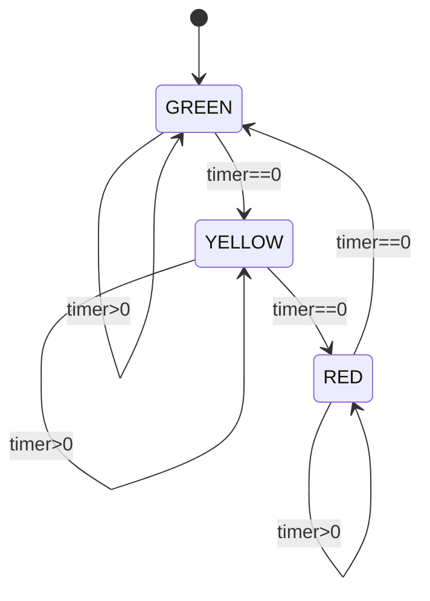

# EE115B HDL 编程练习（Verilog · VHDL · HDLBits/MIT/Berkeley/清华）

<aside>
💻

**用途：** 按 EE115B 期末范围＋开源题源（[HDLBits](https://hdlbits.01xz.net/wiki/Main_Page) / MIT 6.111·6.004 / Berkeley CS61C·EECS151 / 清华阎石《数字电子技术基础》）出的 **Verilog ＋ VHDL** 练习。

**⚠️ 先认清考试现实：** 老师明确说期末 **不要求现场手写完整程序**，但 **Verilog / VHDL 的 grammar(语法)＋concepts(概念)** 会考。所以 **Part 0「概念辨析」＋ Part 1「改错题」是性价比最高、最贴期末**的；后面 Part 2–5 的真·编码题用来把语法吃透、顺带刷 HDLBits（HW4 用过）。

**用法：** 每个 Part 前有「📌 知识点回顾」，先扫一眼；自己先写，再展开「✅ 答案」对照。**不要边写边偷看**——ADHD 最容易在这里丢分。

**今晚学习块：** 只锁 **1 个 25–45 分钟 block**，建议先做 **Part 0 ＋ Part 1**（概念＋改错，直接对位期末），有余力再挑 Part 3 的一道 FSM。别 A→B→C 乱跳；冒出的别的念头先记 cache。

</aside>

## Ⅰ. 概念 & 语法辨析（最贴期末）⭐

<aside>
📌

**知识点回顾：** `module`/`entity` 区别 · `always @(*)` vs `always @(posedge clk)` · blocking(`=`) vs non-blocking(`<=`) · `wire` vs `reg` · `assign` 连续赋值 · `initial`/testbench 不可综合(non-synthesizable) · VHDL `entity`/`architecture`/`process` · signal(`<=`) vs variable(`:=`) · `rising_edge` · `std_logic` · 组合 vs 时序描述 · simulation vs synthesis。

</aside>

### A. 单选 Multiple Choice

1. 在 Verilog 中描述**时序逻辑(sequential logic)**，对寄存器赋值应使用：
    - [ ]  A. 阻塞赋值 blocking `=`
    - [ ]  B. 非阻塞赋值 non-blocking `<=`
    - [ ]  C. 连续赋值 `assign`
    - [ ]  D. `initial` 块
2. 下列哪种写法用于描述**纯组合逻辑(combinational)**：
    - [ ]  A. `always @(posedge clk)`
    - [ ]  B. `always @(negedge clk)`
    - [ ]  C. `always @(*)`
    - [ ]  D. `always @(posedge clk or posedge rst)`
3. Verilog 里 `reg` 类型的正确理解是：
    - [ ]  A. 一定综合(synthesize)成一个物理寄存器
    - [ ]  B. 只是“可在过程块中被赋值的变量”，不一定是寄存器
    - [ ]  C. 等价于 VHDL 的 `variable`
    - [ ]  D. 只能用于 testbench
4. 关于 `assign` 连续赋值语句，正确的是：
    - [ ]  A. 只能给 `reg` 赋值
    - [ ]  B. 只能出现在 `always` 块内部
    - [ ]  C. 给 `wire` 赋值，描述组合逻辑，持续生效
    - [ ]  D. 在时钟沿才更新
5. 在 VHDL 中，**进程(process)** 的敏感表(sensitivity list)对一个时钟触发器应包含：
    - [ ]  A. 所有输入信号
    - [ ]  B. 仅时钟（及异步复位）
    - [ ]  C. 不需要敏感表
    - [ ]  D. 只包含输出
6. VHDL 中检测时钟上升沿，最规范的写法是：
    - [ ]  A. `if clk = '1' then`
    - [ ]  B. `if clk'event and clk = '1'` 或 `if rising_edge(clk)`
    - [ ]  C. `wait for 10 ns`
    - [ ]  D. `process(all)`
7. VHDL 里 signal 赋值 `<=` 与 variable 赋值 `:=` 的关键区别是：
    - [ ]  A. 没有区别
    - [ ]  B. signal 在进程结束（或一个 delta 周期）后才更新；variable 立即更新
    - [ ]  C. variable 是全局的
    - [ ]  D. signal 只能在 testbench 用
8. 下列哪一项**不可综合(non-synthesizable)**、通常只用于仿真：
    - [ ]  A. `assign y = a & b;`
    - [ ]  B. `always @(posedge clk)`
    - [ ]  C. `initial begin ... end` 与 `$display`
    - [ ]  D. `case` 语句
9. 在组合逻辑 `always @(*)` 中，`if`/`case` **分支不完整**最常见的后果是：
    - [ ]  A. 编译报错
    - [ ]  B. 综合出一个**意外的锁存器(inferred latch)**
    - [ ]  C. 自动补 0
    - [ ]  D. 变成时序逻辑
10. Verilog `module` 与 VHDL `entity + architecture` 的对应关系，正确的是：
    - [ ]  A. `module` 只对应 `entity`，与 `architecture` 无关
    - [ ]  B. `entity` 声明端口接口，`architecture` 描述内部实现，合起来 ≈ 一个 `module`
    - [ ]  C. `architecture` 等价于 testbench
    - [ ]  D. VHDL 没有端口概念
- ✅ 答案与解析（做完再展开）
    1. **B** — 时序逻辑用 non-blocking `<=`，避免同一时钟沿的竞争(race)。组合逻辑才用 `=`。
    2. **C** — `always @(*)` 自动包含所有输入，描述组合逻辑；带 `posedge clk` 的是时序。
    3. **B** — `reg` 只是“过程块里可被赋值的量”，可能综合成线网(组合)也可能成寄存器，**不等于物理寄存器**。这是最大坑。
    4. **C** — `assign` 给 `wire`，持续驱动 → 组合逻辑。
    5. **B** — 时钟触发器只对 clk（＋异步复位）敏感；把数据放进敏感表是错的。
    6. **B** — `rising_edge(clk)` 或 `clk'event and clk='1'`。
    7. **B** — variable `:=` 立即更新（顺序语义）；signal `<=` 延迟到进程挂起后更新（delta delay）。
    8. **C** — `initial`/`$display` 是仿真用，不可综合。
    9. **B** — 分支不完整 → 需要“记住上一个值” → 综合器插入 latch。**必须写 else / default 或在开头给默认值。**
    10. **B** — `entity` = 接口(interface)，`architecture` = 实现(implementation)。

### B. 判断 True / False

Write **T** / **F**.

1. `always @(*)` 等价于把所有右侧信号都写进敏感表。
    - [ ]  T
    - [ ]  F
2. 在 Verilog 时序块里混用 `=` 和 `<=` 是安全的、推荐的写法。
    - [ ]  T
    - [ ]  F
3. VHDL 的 `std_logic` 比 `bit` 多了 `'Z'`(高阻)、`'X'`(未知) 等取值，更贴近真实硬件。
    - [ ]  T
    - [ ]  F
4. 同一个 `entity` 可以有多个不同的 `architecture` 实现。
    - [ ]  T
    - [ ]  F
5. synthesis(综合) 与 simulation(仿真) 的结果一定完全一致。
    - [ ]  T
    - [ ]  F
6. Verilog 中 `wire` 不能在 `always` 块里用 `=`/`<=` 赋值。
    - [ ]  T
    - [ ]  F
- ✅ 答案与解析
    1. **T** — `@(*)` 就是自动敏感表，防止漏写信号造成仿真/综合不一致。
    2. **F** — 时序块统一用 `<=`，组合块统一用 `=`；混用易出竞争。
    3. **T** — 9 值逻辑(`std_logic`)能表达 Z/X，`bit` 只有 0/1。
    4. **T** — 一个接口可挂多种实现（behavioral / structural / RTL）。
    5. **F** — 写法不当（如推断 latch、敏感表漏信号、`initial` 仅仿真有效）会导致两者**不一致**，这是大坑。
    6. **T** — 过程块里被赋值的量必须是 `reg`；`wire` 用 `assign` 驱动。

### C. 填空 Fill in the Blanks

1. 组合逻辑用 __ 赋值（`=`/`<=`）；时序逻辑用 __ 赋值。
2. VHDL 中声明电路接口（端口）的部分叫 **，描述内部行为的部分叫 _**_。
3. 在组合 `always @(*)` 中若 `case` 不写 `default`，可能被综合成意外的 __。
4. VHDL 检测上升沿的内置函数是 __(clk)。
5. Verilog 里持续驱动 `wire` 的赋值关键字是 __。
6. VHDL 中立即更新的是 **(signal/variable)，延迟更新的是 _**_。
- ✅ 答案
    1. `=` ／ `<=`
    2. **entity** ／ **architecture**
    3. **latch（锁存器）**
    4. **rising_edge**
    5. **assign**
    6. **variable** ／ **signal**

## Ⅱ. 改错题 Debug（HDLBits Bugs 风格 · 直击概念）🐞

<aside>
🐞

**为什么放在前面：** 期末爱考“这段代码错在哪 / 会综合出什么”。看出 bug = 真懂概念。每题先自己找错，再展开看修正。

</aside>

### Bug 1 — 组合逻辑漏分支 → 推断出锁存器

```verilog
// 想做一个 2-to-4 译码器，但有 bug
module dec(input [1:0] a, output reg [3:0] y);
    always @(*) begin
        case (a)
            2'b00: y = 4'b0001;
            2'b01: y = 4'b0010;
            2'b10: y = 4'b0100;
        endcase
    end
endmodule
```

- ✅ 错在哪 + 修正
    - **Bug：** `case` 漏了 `2'b11`，且没有 `default`。组合块里“某些输入下 y 没被赋值” → 综合器为了“保持旧值”插入 **latch（意外锁存器）**。
    - **修正（任选其一）：** 补 `default`，或在 `case` 前给默认值。
    
    ```verilog
    always @(*) begin
        y = 4'b0000;        // 开头给默认值，最稳
        case (a)
            2'b00: y = 4'b0001;
            2'b01: y = 4'b0010;
            2'b10: y = 4'b0100;
            2'b11: y = 4'b1000;
        endcase
    end
    ```
    
    - **口诀：组合 always 要么写满所有分支，要么开头给默认值。**

### Bug 2 — 时序块用了阻塞赋值导致移位寄存器错乱

```verilog
// 想做 3 级移位寄存器 q2<-q1<-q0<-din
module sh(input clk, input din, output reg q0, q1, q2);
    always @(posedge clk) begin
        q0 = din;
        q1 = q0;
        q2 = q1;
    end
endmodule
```

- ✅ 错在哪 + 修正
    - **Bug：** 时序块用阻塞 `=`，顺序执行使 `q0,q1,q2` 在同一沿全部变成 `din`，**移位变成直通**。
    - **修正：** 时序块统一用 non-blocking `<=`，三级才会真正逐级移位。
    
    ```verilog
    always @(posedge clk) begin
        q0 <= din;
        q1 <= q0;
        q2 <= q1;
    end
    ```
    
    - **口诀：时序块永远 `<=`。**

### Bug 3 — 敏感表不全，仿真与综合不一致

```verilog
module and2(input a, b, output reg y);
    always @(a) begin   // 只写了 a
        y = a & b;
    end
endmodule
```

- ✅ 错在哪 + 修正
    - **Bug：** 敏感表漏了 `b`。`b` 单独变化时进程不触发 → **仿真**里 y 不更新，但**综合**会当成组合逻辑（和 a&b 一致）→ sim/synth 不一致。
    - **修正：** 用 `always @(*)`（或 `@(a or b)`）。
    
    ```verilog
    always @(*) y = a & b;
    ```
    

### Bug 4 — VHDL 进程缺时钟敏感 / 复位写法

```vhdl
-- 想做带异步复位的 D 触发器，但有 bug
architecture bad of dff is
begin
    process(d)                 -- 敏感表写成了 d
    begin
        if rst = '1' then
            q <= '0';
        elsif clk = '1' then   -- 用电平判断
            q <= d;
        end if;
    end process;
end architecture;
```

- ✅ 错在哪 + 修正
    - **Bug 1：** 敏感表应是 `(clk, rst)`，不是 `d`。
    - **Bug 2：** `clk = '1'` 是**电平敏感** → 综合成 latch，不是边沿触发 FF。应用 `rising_edge(clk)`。
    
    ```vhdl
    process(clk, rst)
    begin
        if rst = '1' then          -- 异步复位
            q <= '0';
        elsif rising_edge(clk) then
            q <= d;
        end if;
    end process;
    ```
    

## Ⅲ. Verilog 组合逻辑（HDLBits 风格）🔵

<aside>
📌

**知识点回顾：** `assign` / 三目运算 / `case` / `casez` 优先编码 / 位拼接 `{ }` / 进位拼接 `{cout,sum}=a+b+cin`。先自己写，再对照。

</aside>

1. **2-to-1 MUX**：`sel=0` 输出 `a`，否则 `b`（一行 `assign`）。
2. **4-to-1 MUX**：4 路 `d[3:0]`，2 位 `sel`，用 `case`。
3. **3-to-8 译码器**：`in[2:0]` → one-hot `y[7:0]`。
4. **8-to-3 优先编码器**：`in[7:0]`，输出最高有效位下标 `pos[2:0]`，全 0 时输出 0（用 `casez`）。
5. **4-bit 全加器**：`a,b[3:0]`、`cin` → `sum[3:0]`、`cout`。
6. **4-bit 比较器**：输出 `gt, eq, lt`。
- ✅ 参考实现
    
    ```verilog
    // 1. 2-to-1 MUX
    module mux2(input a, b, sel, output y);
        assign y = sel ? b : a;
    endmodule
    
    // 2. 4-to-1 MUX
    module mux4(input [3:0] d, input [1:0] sel, output reg y);
        always @(*) case (sel)
            2'b00: y = d[0];
            2'b01: y = d[1];
            2'b10: y = d[2];
            2'b11: y = d[3];
        endcase
    endmodule
    
    // 3. 3-to-8 译码器
    module dec3to8(input [2:0] in, output [7:0] y);
        assign y = 8'b1 << in;
    endmodule
    
    // 4. 8-to-3 优先编码器（最高位优先）
    module pri_enc(input [7:0] in, output reg [2:0] pos);
        always @(*) casez (in)
            8'b1???????: pos = 3'd7;
            8'b01??????: pos = 3'd6;
            8'b001?????: pos = 3'd5;
            8'b0001????: pos = 3'd4;
            8'b00001???: pos = 3'd3;
            8'b000001??: pos = 3'd2;
            8'b0000001?: pos = 3'd1;
            8'b00000001: pos = 3'd0;
            default:     pos = 3'd0;
        endcase
    endmodule
    
    // 5. 4-bit 全加器
    module adder4(input [3:0] a, b, input cin,
                  output [3:0] sum, output cout);
        assign {cout, sum} = a + b + cin;
    endmodule
    
    // 6. 4-bit 比较器
    module cmp4(input [3:0] a, b, output gt, eq, lt);
        assign gt = (a > b);
        assign eq = (a == b);
        assign lt = (a < b);
    endmodule
    ```
    
    - **ADHD 陷阱：** 优先编码器用 `casez`（`?` 表示 don't-care）；进位用 `{cout,sum}` 一次拼出。

## Ⅳ. Verilog 时序逻辑 + FSM 🟣

<aside>
📌

**知识点回顾：** `always @(posedge clk)` + `<=` · 同步 vs 异步复位 · mod-N 计数 · 移位寄存器 · FSM 三段式（状态寄存器 / 次态逻辑 / 输出逻辑）· Moore vs Mealy。

</aside>

1. **D 触发器（异步低有效复位）**：`arst_n=0` 时 `q=0`。
2. **BCD（mod-10）计数器**：同步复位，数到 9 回 0。
3. **4-bit 左移寄存器**：串行输入 `sin`，同步复位。
4. **边沿检测器(edge detector)**：`in` 出现 0→1 时 `pedge` 拉高一拍（HDLBits Edgedetect / Berkeley 常考）。
5. **「101」序列检测器（Moore，允许重叠 overlap）**：检出输出 `z=1`。
6. **可被 3 整除检测器（MIT 6.004，MSB first）**：边读边判，能被 3 整除则 `light=1`。
- ✅ 参考实现
    
    ```verilog
    // 1. D-FF 异步低有效复位
    module dff_ar(input clk, arst_n, d, output reg q);
        always @(posedge clk or negedge arst_n)
            if (!arst_n) q <= 1'b0;
            else         q <= d;
    endmodule
    
    // 2. BCD mod-10 计数器（同步复位）
    module bcd(input clk, rst, output reg [3:0] q);
        always @(posedge clk)
            if (rst)        q <= 4'd0;
            else if (q==9)  q <= 4'd0;
            else            q <= q + 4'd1;
    endmodule
    
    // 3. 4-bit 左移寄存器
    module shl4(input clk, rst, sin, output reg [3:0] q);
        always @(posedge clk)
            if (rst) q <= 4'b0;
            else     q <= {q[2:0], sin};
    endmodule
    
    // 4. 上升沿检测器
    module edge_det(input clk, in, output reg pedge);
        reg in_d;
        always @(posedge clk) begin
            in_d  <= in;
            pedge <= in & ~in_d;
        end
    endmodule
    
    // 5. 「101」Moore 检测器（可重叠），三段式
    module seq101(input clk, rst, x, output z);
        localparam S0=2'd0, S1=2'd1, S2=2'd2, S3=2'd3;
        reg [1:0] state, next;
        always @(posedge clk)            // ① 状态寄存器
            state <= rst ? S0 : next;
        always @(*) case (state)         // ② 次态逻辑
            S0: next = x ? S1 : S0;      // 收到1→已见\"1\"
            S1: next = x ? S1 : S2;      // 收到0→已见\"10\"
            S2: next = x ? S3 : S0;      // 收到1→已见\"101\"
            S3: next = x ? S1 : S2;      // 重叠：S3的末位1可作下一段开头
            default: next = S0;
        endcase
        assign z = (state == S3);        // ③ Moore 输出：只看现态
    endmodule
    
    // 6. 可被3整除检测器（MIT 6.004，MSB first，N'=2N+b）
    module div3(input clk, rst, b, output light);
        reg [1:0] r;                     // 余数 N mod 3
        always @(posedge clk)
            if (rst) r <= 2'd0;
            else case (r)
                2'd0: r <= b ? 2'd1 : 2'd0;
                2'd1: r <= b ? 2'd0 : 2'd2;
                2'd2: r <= b ? 2'd2 : 2'd1;
                default: r <= 2'd0;
            endcase
        assign light = (r == 2'd0);
    endmodule
    ```
    
    - **ADHD 陷阱：** ①Moore 输出标在“状态”上（`z=(state==S3)`），不要写成 Mealy；②重叠检测器检出后不要回 `S0`，要留已匹配前缀；③`div3` 是 MSB first 用 `2N+b`，LSB first 转移完全不同。

## Ⅴ. VHDL 题（entity · architecture · process）🟢

<aside>
📌

**知识点回顾：** `library ieee; use ieee.std_logic_1164.all;` · `entity`/`architecture` · `with...select` / `when...else` 并发语句 · `process` 顺序语句 · `rising_edge` · `numeric_std` 的 `unsigned`/`to_unsigned`。

</aside>

1. **2-to-1 MUX**（`when...else` 并发赋值）。
2. **4-to-1 MUX**（`with sel select`）。
3. **4-bit 加法器**（`numeric_std`，带 cout）。
4. **D 触发器**（同步复位，`rising_edge`）。
5. **mod-N 计数器**（`generic` 参数化）。
6. **「101」Moore 检测器**（双进程：状态寄存器 + 次态/输出）。
- ✅ 参考实现
    
    ```vhdl
    library ieee;
    use ieee.std_logic_1164.all;
    use ieee.numeric_std.all;
    
    -- 1. 2-to-1 MUX
    entity mux2 is
        port (a, b, sel : in std_logic; y : out std_logic);
    end entity;
    architecture rtl of mux2 is
    begin
        y <= a when sel = '0' else b;
    end architecture;
    
    -- 2. 4-to-1 MUX
    entity mux4 is
        port (d : in std_logic_vector(3 downto 0);
              sel : in std_logic_vector(1 downto 0);
              y : out std_logic);
    end entity;
    architecture rtl of mux4 is
    begin
        with sel select
            y <= d(0) when \"00\",
                 d(1) when \"01\",
                 d(2) when \"10\",
                 d(3) when others;
    end architecture;
    
    -- 3. 4-bit 加法器
    entity adder4 is
        port (a, b : in  unsigned(3 downto 0);
              cin  : in  std_logic;
              sum  : out unsigned(3 downto 0);
              cout : out std_logic);
    end entity;
    architecture rtl of adder4 is
        signal s : unsigned(4 downto 0);
    begin
        s    <= ('0' & a) + ('0' & b) + (\"0000\" & cin);
        sum  <= s(3 downto 0);
        cout <= s(4);
    end architecture;
    
    -- 4. D 触发器（同步复位）
    entity dff is
        port (clk, rst, d : in std_logic; q : out std_logic);
    end entity;
    architecture rtl of dff is
    begin
        process(clk)
        begin
            if rising_edge(clk) then
                if rst = '1' then q <= '0';
                else              q <= d;
                end if;
            end if;
        end process;
    end architecture;
    
    -- 5. mod-N 计数器（参数化）
    entity counter is
        generic (N : integer := 10);
        port (clk, rst : in std_logic;
              q : out std_logic_vector(3 downto 0));
    end entity;
    architecture rtl of counter is
        signal cnt : unsigned(3 downto 0);
    begin
        process(clk)
        begin
            if rising_edge(clk) then
                if rst = '1' or cnt = to_unsigned(N-1, 4) then
                    cnt <= (others => '0');
                else
                    cnt <= cnt + 1;
                end if;
            end if;
        end process;
        q <= std_logic_vector(cnt);
    end architecture;
    
    -- 6. 「101」Moore 检测器（双进程）
    entity seq101 is
        port (clk, rst, x : in std_logic; z : out std_logic);
    end entity;
    architecture rtl of seq101 is
        type state_t is (S0, S1, S2, S3);
        signal state, nstate : state_t;
    begin
        process(clk)                       -- 状态寄存器
        begin
            if rising_edge(clk) then
                if rst = '1' then state <= S0;
                else              state <= nstate;
                end if;
            end if;
        end process;
        process(state, x)                  -- 次态逻辑
        begin
            case state is
                when S0 => if x='1' then nstate<=S1; else nstate<=S0; end if;
                when S1 => if x='1' then nstate<=S1; else nstate<=S2; end if;
                when S2 => if x='1' then nstate<=S3; else nstate<=S0; end if;
                when S3 => if x='1' then nstate<=S1; else nstate<=S2; end if;
            end case;
        end process;
        z <= '1' when state = S3 else '0';  -- Moore 输出
    end architecture;
    ```
    
    - **ADHD 陷阱：** ①状态寄存器进程敏感表只放 `clk`；②次态进程是组合逻辑，`case` 每个 `when` 都要把 `nstate` 赋满，否则 VHDL 也会推断 latch；③`unsigned` 运算记得 `use ieee.numeric_std.all`，不要用过时的 `std_logic_unsigned`。

## Ⅵ. 名校 / 开源高难综合题（MIT · Berkeley · 清华）🔥

<aside>
🔥

**难度 ★★★★☆~★★★★★。** 把 FSM＋计数＋时序约束揉进一题。**今晚只挑 1 题啃透**（建议 Problem B 交通灯），其余留二轮。

</aside>

### Problem A — 清华阎石风格：4-bit 环形 / 扭环(Johnson)计数器 ★★★★

<aside>
📌

**回顾：** 环形(ring)计数器 = one-hot 循环移位（N 状态需 N 个 FF）；扭环(Johnson)= 末位取反反馈（N 个 FF 得 2N 状态）。

</aside>

用 Verilog 写一个 **4-bit Johnson（扭环）计数器**，同步复位后从 `0000` 开始，给出状态序列并说明它有几个有效状态。

- ✅ 参考实现 + 解析
    
    ```verilog
    module johnson4(input clk, rst, output reg [3:0] q);
        always @(posedge clk)
            if (rst) q <= 4'b0000;
            else     q <= {~q[0], q[3:1]};  // 末位取反送回最高位
    endmodule
    ```
    
    - **状态序列（8 个有效态）：** `0000 → 1000 → 1100 → 1110 → 1111 → 0111 → 0011 → 0001 → 0000 …`
    - **要点：** 4 个 FF 得 `2×4 = 8` 个状态（普通 ring 只有 4 个）。未用状态需考虑自启动(self-start)，工程上加复位或纠偏逻辑。
    - **ADHD 陷阱：** ring 是直接循环移位 `{q[0],q[3:1]}`；Johnson 多了个“取反” `~q[0]`，别写混。

### Problem B — MIT 6.111 / Berkeley 风格：交通灯 FSM（带计时）★★★★★

<aside>
📌

**回顾：** 带计时的 FSM = 状态机 + 一个倒计时计数器；进入新状态时载入该状态时长，计到 0 才跳转。

</aside>

用 Verilog 设计一个 **Moore 交通灯**：`GREEN(3 拍) → YELLOW(1 拍) → RED(2 拍) → GREEN…`。输出 `light[1:0]`（00=红 01=黄 10=绿）。给状态图思路 + Verilog。



- ✅ 参考实现 + 解析
    
    ```verilog
    module traffic(input clk, rst, output reg [1:0] light);
        localparam GREEN=2'd2, YELLOW=2'd1, RED=2'd0;
        reg [1:0] state;
        reg [2:0] timer;          // 倒计时
        always @(posedge clk) begin
            if (rst) begin
                state <= GREEN; timer <= 3'd2;   // 绿 3 拍 → 载入 2 再算当前这拍
            end else if (timer != 0) begin
                timer <= timer - 3'd1;           // still 计时
            end else begin
                case (state)
                    GREEN:  begin state <= YELLOW; timer <= 3'd0; end // 黄1拍
                    YELLOW: begin state <= RED;    timer <= 3'd1; end // 红2拍
                    RED:    begin state <= GREEN;  timer <= 3'd2; end // 绿3拍
                    default:begin state <= GREEN;  timer <= 3'd2; end
                endcase
            end
        end
        always @(*) light = state;   // Moore：输出只看现态
    endmodule
    ```
    
    - **要点：** 时长 = 载入值 + 1（载入 N-1，从 N-1 倒数到 0 共 N 拍）。绿载 2→3 拍、黄载 0→1 拍、红载 1→2 拍。
    - **ADHD 陷阱：** ①输出是 Moore，只看 `state`；②“计满才跳转”——必须先判 `timer!=0`，否则会每拍乱跳；③别忘了 `default` 防止落到未用态死锁。

### Problem C — Berkeley CS61C / EECS151：跨时钟域两级同步器 ★★★★

<aside>
📌

**回顾：** 把异步信号送进时钟域，直接用会引发亚稳态(metastability)；标准做法是**两级触发器同步器(2-FF synchronizer)**。

</aside>

用 Verilog 写一个**两级同步器**，把异步输入 `async_in` 同步到 `clk` 域输出 `sync_out`，并一句话说明为什么要两级。

- ✅ 参考实现 + 解析
    
    ```verilog
    module sync2(input clk, async_in, output sync_out);
        reg ff1, ff2;
        always @(posedge clk) begin
            ff1 <= async_in;   // 第一级：可能进入亚稳态
            ff2 <= ff1;        // 第二级：给亚稳态一拍时间衰减
        end
        assign sync_out = ff2;
    endmodule
    ```
    
    - **为什么两级：** 第一级 FF 采到异步信号可能亚稳态(metastable)；再过一级 FF，给它一个时钟周期“稳定/衰减”，第二级输出为稳定值的概率大幅提高（降低 MTBF 风险）。
    - **ADHD 陷阱：** 同步器只解决“单 bit 电平/脉冲”跨域；多 bit 总线要用握手或异步 FIFO，不能简单两级同步。

<aside>
📚

**题目来源：** [HDLBits](https://hdlbits.01xz.net/wiki/Main_Page)（组合/时序/FSM/Bugs 题型）、[MIT 6.111](https://courses.csail.mit.edu/6.111/f2004/tutprobs/fsms.html) 与 6.004（divisible-by-3、交通灯）、[Berkeley CS61C SDS](https://notes.cs61c.org/content/sds-state/summary/) 与 [EECS151](https://www2.eecs.berkeley.edu/Courses/EECS151/)（时序约束、同步器）、清华阎石《数字电子技术基础》（环形/扭环计数器）。题目与数值为便于复习做了改写整理。

</aside>

## ✅ 自查清单（写完对自己问）

- [ ]  **组合用 `=`、时序用 `<=`**；时序块没误用阻塞赋值。
- [ ]  **组合 `always @(*)` / VHDL 组合进程：分支写满或给默认值**，没意外推断出 latch。
- [ ]  **敏感表对**：组合 `@(*)`；时序只放 clk(＋异步复位)；VHDL 同理。
- [ ]  **Moore 输出标在“状态”上，Mealy 才看 state+input**，没画混。
- [ ]  **重叠序列检测**检出后保留已匹配前缀，没傻回 `S0`。
- [ ]  **VHDL：** `entity`=接口 / `architecture`=实现；`rising_edge(clk)` 而非电平判断；用 `numeric_std`。
- [ ]  **`reg` ≠ 物理寄存器；`initial`/`$display` 仅仿真不可综合。**

<aside>
🐈

**下次打开第一步：** 先只做 **Part 0 的 A 单选 10 题**，做完立刻对答案，把错的概念点抄进 [EE115B 错题本](../../EE115B%20%E9%94%99%E9%A2%98%E6%9C%AC.csv)，再继续。一次一个 block，别 A→B→C 乱跳。

</aside>